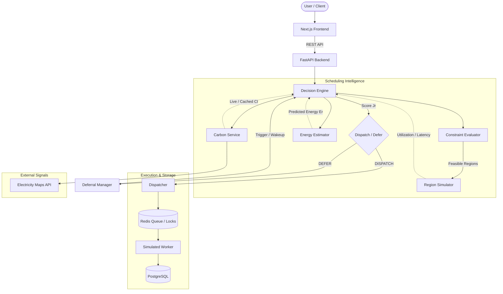

# 🌱 EcoRoute

**Carbon-Aware Cloud Workload Scheduler**

EcoRoute is a research-oriented cloud workload scheduling system that optimizes workload placement across simulated cloud regions by balancing carbon intensity, operational deadlines, capacity utilization, performance, and network latency.

---

## 1. Overview

Conventional schedulers optimize primarily for latency, cost, and availability without accounting for the varying carbon intensity ($g\text{CO}_2\text{eq}/\text{kWh}$) of regional electrical grids. 

EcoRoute implements a **constraint-first, multi-objective scheduling architecture** that estimates energy and carbon impact before dispatch while strictly respecting deadlines, priorities, and hardware capacity constraints.

---

## 2. System Workflow



* **PostgreSQL**: Authoritative durable store for jobs, attempts, decisions, audit trails, and experiments.
* **Redis**: Supporting infrastructure for carbon caching, distributed claim locks, and dispatch queues.

---

## 3. Core Scheduling Model

EcoRoute evaluates feasible candidate regions using a normalized multi-objective cost function:

$$J_r = w_C \cdot N(E_r \times CI_r) + w_T \cdot N(T_r) + w_U \cdot N(U_r) + w_L \cdot N(L_r)$$

Where:
* $E_r$: Estimated energy consumption in region $r$ (kWh)
* $CI_r$: Grid carbon intensity ($g\text{CO}_2\text{eq}/\text{kWh}$)
* $T_r$: Predicted duration in region $r$ (seconds)
* $U_r$: Simulated regional utilization ($0.0 - 1.0$)
* $L_r$: Network latency (ms)
* $N(\cdot)$: Min-max normalization across feasible regions
* $w_C, w_T, w_U, w_L$: Configurable weights ($\sum w = 1.0$)

> **Hard Constraints First**: Feasibility checks (capacity, hardware compatibility, and deadlines) prune non-viable regions before optimization. Lowest $J_r$ is selected.

---

## 4. Key Features

* **Constraint-First Selection**: Prunes non-viable regions prior to scoring.
* **Carbon-Aware Placement**: Incorporates live grid carbon intensity into scheduling decisions.
* **Deterministic Energy Estimation**: Models power dynamics from workload demands and regional profiles.
* **Graceful Fallback (No Fabrication)**: Uses live data $\to$ cache $\to$ conventional scheduling without inventing carbon metrics.
* **Dynamic Deferral**: Defers flexible jobs when near-term green windows exist within deadline slack.
* **Isolated Retries**: Generates a distinct `Attempt ID` and requests a fresh scheduling decision upon failure.
* **Atomic Claiming**: Prevents duplicate executions across concurrent workers via distributed locks.
* **Full Auditability & Reproducibility**: Logs complete decision telemetry and supports frozen-seed experiment baselines.

---

## 5. Technology Stack

| Tier | Technologies | Role |
| :--- | :--- | :--- |
| **Frontend** | Next.js 16, TypeScript, Tailwind CSS, shadcn/ui, MapLibre GL | Workload submission, telemetry monitoring, geographic carbon maps, and experiment results. |
| **Backend** | FastAPI, Python 3.13+, Pydantic v2, SQLAlchemy 2.0 | Core scheduling engine, simulation, energy estimation, retry coordination, and REST APIs. |
| **Data & Cache** | PostgreSQL, Redis | PostgreSQL for durable persistence; Redis for carbon caching, locks, and dispatch queues. |
| **Integrations** | Electricity Maps, AWS / Azure / GCP Metadata | Electricity Maps for grid carbon signals; cloud metadata for simulated regional profiles. |

> [!NOTE]
> All execution regions are **logical and simulated**. EcoRoute does not provision or execute live cloud VMs/containers.

---

## 6. Architecture Documentation

Detailed specifications are maintained in the [`docs/architecture/`](docs/architecture/) directory:

* [System Architecture](docs/architecture/system-architecture.md) — Topology, modular monolith boundaries, and technology stack.
* [Component Architecture](docs/architecture/component-architecture.md) — Specifications for all 15 internal modules and engine boundaries.
* [Data Architecture](docs/architecture/data-architecture.md) — Relational schema, Redis role, and Job/Attempt state machines.
* [Reliability Architecture](docs/architecture/reliability-architecture.md) — Attempt isolation, retry mechanics, atomic claims, and data flow diagrams.
* [Architecture Decisions (ADRs)](docs/architecture/architecture-decisions.md) — 13 Architecture Decision Records and Requirements Traceability Matrix (FR1–FR10).

---

## 7. Scope & Boundaries

* **Simulated Environment**: Regional infrastructure and workload execution are simulated models.
* **Modeled Energy**: Energy consumption ($E_r$) is estimated via mathematical power models rather than physical wattmeters.
* **Signal Dependency**: External carbon feeds are consumed when available; system falls back safely when unavailable.
* **Empirical Benchmarks**: Carbon savings depend on grid volatility, workload deadlines, and baseline comparisons.

---

## 8. Getting Started & Development

### 8.1 Prerequisites
* **Python**: `3.11+` / `3.13+`
* **Node.js**: `20.x` or later & `npm`
* **PostgreSQL**: PostgreSQL 15+ instance (or managed [Supabase](https://supabase.com) project)
* **Redis**: Redis 7+ instance (local or hosted)

---

### 8.2 Backend Setup (FastAPI)

1. **Create and activate a virtual environment**:
   ```bash
   python -m venv .venv
   
   # On Windows (PowerShell):
   .\.venv\Scripts\Activate.ps1
   
   # On macOS/Linux:
   source .venv/bin/activate
   ```

2. **Install dependencies**:
   ```bash
   pip install -r backend/requirements.txt
   ```

3. **Configure environment variables**:
   ```bash
   cp backend/.env.example backend/.env
   ```
   *Edit `backend/.env` to configure your PostgreSQL and Redis connections:*
   ```ini
   ENVIRONMENT=development
   LOG_LEVEL=INFO
   HOST=0.0.0.0
   PORT=8000
   
   # Supabase / PostgreSQL async connection string (asyncpg)
   DATABASE_URL=postgresql+asyncpg://<username>:<password>@<host>:<port>/<database>
   
   # Redis connection URL
   REDIS_URL=redis://localhost:6379/0
   
   # CORS origins
   CORS_ORIGINS=["http://localhost:3000"]
   ```

4. **Run unit tests**:
   ```bash
   pytest backend/tests
   ```

5. **Start the development server**:
   ```bash
   python -m uvicorn app.main:app --app-dir backend --reload --port 8000
   ```
   *API Swagger documentation is accessible at `http://localhost:8000/docs`.*

---

### 8.3 Frontend Setup (Next.js 16)

1. **Install dependencies**:
   ```bash
   cd frontend
   npm install
   ```

2. **Configure environment variables**:
   ```bash
   cp .env.example .env.local
   ```
   *Ensure `frontend/.env.local` points to the FastAPI backend:*
   ```ini
   NEXT_PUBLIC_API_URL=http://localhost:8000
   ```

3. **Typecheck & build validation**:
   ```bash
   npm run typecheck
   npm run build
   ```

4. **Start the Next.js development server**:
   ```bash
   npm run dev
   ```
   *Access the web application at `http://localhost:3000`.*

---

### 8.4 Health & Connectivity Verification

EcoRoute provides both a standalone CLI script and HTTP probe endpoints to verify that the API layer, PostgreSQL database, and Redis cache are functioning:

#### 1. Standalone CLI Verification Script
You can directly test PostgreSQL and Redis connectivity at any time from your terminal:
```bash
# Windows (PowerShell):
.\.venv\Scripts\python backend/scripts/check_connectivity.py

# macOS / Linux:
python backend/scripts/check_connectivity.py
```

#### 2. HTTP Health Probes
When FastAPI is running, you can probe system health via REST endpoints:

| Endpoint | Method | Purpose | Expected Response |
| :--- | :--- | :--- | :--- |
| `/health` or `/api/v1/health` | `GET` | Comprehensive system & component status | `{"status": "healthy", "components": {...}}` |
| `/health/live` | `GET` | Fast liveness probe | `{"status": "alive"}` |
| `/health/ready` | `GET` | Readiness probe (fails with 503 if required infra is down) | `{"ready": true, "database": {...}, "redis": {...}}` |

##### Testing Health via cURL:
```bash
curl http://localhost:8000/api/v1/health
```

---

### 8.5 Troubleshooting & Common Notes

* **Async SQLAlchemy Connection String**: Ensure your PostgreSQL URL begins with `postgresql+asyncpg://` rather than standard `postgresql://` or `postgres://`.
* **Missing Infra in Development**: The backend will start cleanly in `development` mode even if PostgreSQL or Redis are not yet configured; the `/api/v1/health` endpoint will report their status as `unconfigured` rather than crashing.
* **CORS Errors**: If accessing from a custom host or port, ensure the origin is listed in the `CORS_ORIGINS` JSON array in `backend/.env`.


