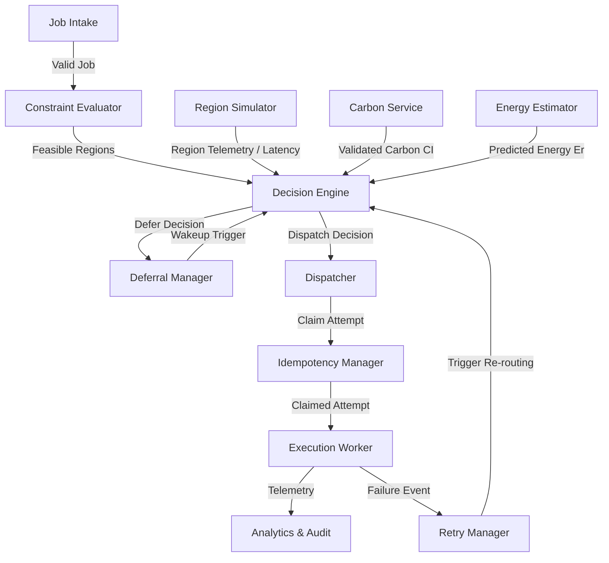

# Component Architecture

This document defines the module specifications, responsibilities, and boundaries within the EcoRoute modular monolith.

---

## 1. Component Overview

---

## 2. Component Specifications

| Component | Purpose & Core Responsibilities | Inputs | Outputs | Non-Responsibilities |
| :--- | :--- | :--- | :--- | :--- |
| **Job Intake** | Validates inbound workloads against Pydantic schemas, assigns `job_id`, persists initial `PENDING` state in PostgreSQL. | Client JSON request | Persisted `Job`, intake event | Feasibility checks, region selection, task dispatch |
| **Decision Engine** | Evaluates candidate regions, computes multi-objective score $J_r$, ranks regions, and issues `DISPATCH` or `DEFER` actions. | Job, Feasible Regions, $CI_r$, $E_r$, $U_r$, $L_r$ | `SchedulingDecision` (ranked regions, score breakdown, action) | Direct hardware simulation, worker task execution |
| **Constraint Evaluator** | Applies hard non-negotiable filters (CPU/memory capacity, hardware match, deadline feasibility $t_{\text{now}} + T_r + L_r \le t_{\text{deadline}}$). | Job demand, live Region state | Set of `Feasible Regions` | Scoring, soft preferences, carbon optimization |
| **Energy Estimator** | Models workload energy consumption ($E_r = \int P(t)dt$) from CPU/RAM demands, duration, and regional idle/peak power specs. | Workload profile, Region power specs, $T_r$ | Predicted $E_r$ (kWh) per region | Carbon emissions calculation, region ranking |
| **Carbon Service** | Fetches live carbon from Electricity Maps, caches with TTLs, and enforces fallback (Live $\to$ Cache $\to$ Bypass). | Region ID / geo coordinates | Validated $CI_r$, data quality flag | Fabricating missing values, region selection |
| **Region Simulator** | Models dynamic regional capacity, utilization ($U_r$), performance degradation, power curves, and simulated network latency ($L_r$). | Seed config, simulation tick, traffic curves | Region telemetry snapshots | Carbon data integration, scheduling decisions |
| **Deferral Manager** | Manages jobs in `WAITING` state; triggers re-evaluation upon carbon forecast drops or when deadline slack expires. | Waiting jobs, carbon signals, clock | Re-evaluation triggers for Decision Engine | Static sleep loops, overriding hard deadlines |
| **Dispatcher** | Creates `JobAttempt` records in PostgreSQL with unique `attempt_id`, locks the target region, enqueues to Redis. | `SchedulingDecision(DISPATCH)` | `JobAttempt(PENDING)`, Redis dispatch message | Task code execution, retry routing |
| **Execution Worker** | Atomically claims attempts, runs simulated workload steps, tracks dynamic energy, and reports final outcome. | Redis dispatch message (`job_id`, `attempt_id`) | Attempt telemetry, success/failure status | Selecting fallback regions on failure |
| **Retry Manager** | Handles failed attempts, verifies remaining retry budget and deadline slack, and requests fresh routing from Decision Engine. | Failed `JobAttempt` | Re-evaluation trigger or terminal `FAILED` state | Automatic reuse of previous region assignment |
| **Idempotency Manager** | Enforces atomic claims on `(job_id, attempt_id)` via Redis locks (`SET NX PX`) and PostgreSQL conditional updates. | Worker claim requests | Claim authorization (`APPROVED` / `REJECTED`) | Scheduling logic, payload parsing |
| **Analytics & Audit** | Ingests decision records, counterfactual baselines, and execution telemetry to generate audit logs and carbon KPIs. | Decisions, attempts, counterfactuals | Audit logs, carbon savings metrics | Real-time scheduling decisions |
| **Experiment Engine** | Runs reproducible scenarios with frozen random seeds to benchmark EcoRoute against conventional scheduler baselines. | Experiment configs, workload batches, seeds | `ExperimentResult` datasets | Modifying live operational state outside experiments |
| **PostgreSQL Store** | Authoritative relational persistence for all entities (`jobs`, `job_attempts`, `decisions`, `regions`, `audits`, `experiments`). | SQLAlchemy queries/mutations | ACID persisted records | In-memory cache operations |
| **Redis Infrastructure** | High-throughput in-memory support for carbon caching, distributed locking, and transient task queues. | Cache keys, lock claims, queue pushes | Cached values, lock status, popped messages | Durable storage of record |
