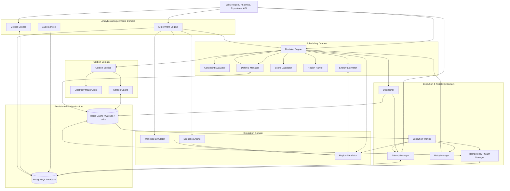
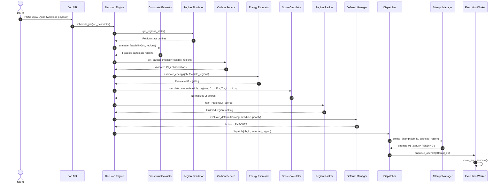
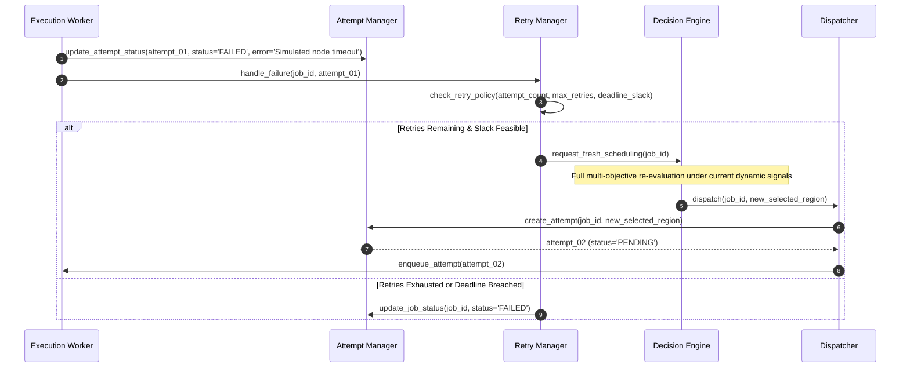
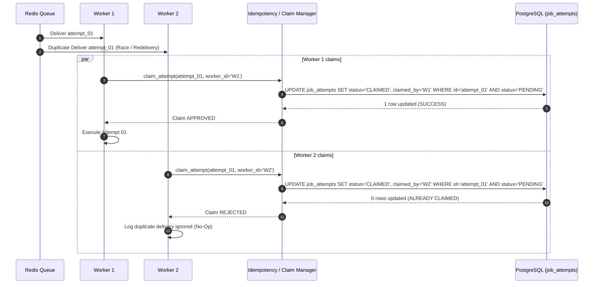

# Component Design

This document defines the internal components of the EcoRoute modular monolith backend (FastAPI), their responsibilities, contracts, inputs/outputs, dependencies, and interaction flows.

---

## 1. Component Group Specifications

### 1.1 API Layer

#### Job API
* **Purpose**: REST interface for workload intake, validation, and status inspection.
* **Responsibilities**:
  * Accepts workload submissions over HTTP.
  * Validates request payloads via Pydantic schemas.
  * Initiates Job creation and passes valid workloads to the scheduling pipeline.
  * Exposes Job lifecycle status and associated Attempt details to clients.
* **Inputs**: Workload submission JSON payloads (CPU, memory, base execution time, priority, deadline).
* **Outputs**: HTTP status codes, serialized `Job` and `JobAttempt` response models.
* **Dependencies**: Decision Engine, Attempt Manager, Persistence (PostgreSQL).
* **Non-Responsibilities**: Applying constraint evaluation, calculating $J_r$ scores, executing workloads, or managing database transactions directly.

#### Region API
* **Purpose**: REST interface exposing logical/simulated region topology and real-time operational status.
* **Responsibilities**:
  * Exposes region metadata (provider, region code, coordinates, hardware specs).
  * Exposes current simulated regional capacity, utilization, and network latency for UI dashboards.
* **Inputs**: Query parameters (region filters, status flags).
* **Outputs**: Serialized regional state and telemetry snapshots.
* **Dependencies**: Region Simulator, Persistence (PostgreSQL).
* **Non-Responsibilities**: Modifying simulator state directly, calculating scheduling scores, or mutating region availability.

#### Analytics API
* **Purpose**: REST interface exposing historical scheduling decisions, audit trails, and aggregate carbon efficiency metrics.
* **Responsibilities**:
  * Serves carbon savings KPIs, counterfactual comparison summaries, and energy metrics.
  * Provides paginated access to immutable audit records.
* **Inputs**: Metric aggregation filters, date ranges, pagination tokens.
* **Outputs**: Formatted analytics summaries, audit log entries.
* **Dependencies**: Analytics & Audit Service, Metrics Service, Persistence (PostgreSQL).
* **Non-Responsibilities**: Calculating real-time scheduling decisions or modifying audit records.

#### Experiment API
* **Purpose**: REST interface for defining, initiating, and inspecting controlled academic scheduling experiments.
* **Responsibilities**:
  * Ingests experiment configuration parameters (seed, scenario type, workload batches, scheduler variants).
  * Triggers experiment execution runs in the Experiment Engine.
  * Exposes comparative experiment results and benchmark metrics.
* **Inputs**: Experiment configuration payloads, experiment IDs.
* **Outputs**: Experiment run status, comparative result sets (`ExperimentResult`).
* **Dependencies**: Experiment Engine, Persistence (PostgreSQL).
* **Non-Responsibilities**: Executing experiment simulation loops or running scheduling algorithms internally.

---

### 1.2 Scheduling Domain

#### Decision Engine
* **Purpose**: Central scheduling intelligence orchestrator coordinating signal gathering, feasibility pruning, scoring, and execute/defer determinations.
* **Responsibilities**:
  * Coordinates the end-to-end evaluation pipeline for submitted and re-evaluated workloads.
  * Orchestrates signal collection across simulators and carbon services.
  * Delegates feasibility filtering to Constraint Evaluator, energy modeling to Energy Estimator, and scoring to Score Calculator.
  * Passes ranked regions to the Deferral Manager to issue final `EXECUTE` or `DEFER` decisions.
* **Inputs**: Valid `Job` descriptor, current environmental and simulation signals.
* **Outputs**: `SchedulingDecision` record containing winning region ID, ranked candidate list, full normalization/score breakdown, and action directive (`EXECUTE` or `DEFER`).
* **Dependencies**: Constraint Evaluator, Energy Estimator, Carbon Service, Score Calculator, Region Ranker, Deferral Manager, Region Simulator, Persistence (PostgreSQL).
* **Non-Responsibilities**: Direct workload execution, raw HTTP carbon API calls, database transaction persistence, carbon value fabrication, or worker retry routing.

#### Constraint Evaluator
* **Purpose**: First-stage feasibility filter evaluating non-negotiable operational and hardware constraints before scoring.
* **Responsibilities**:
  * Validates regional availability flags.
  * Verifies hardware resource capacity (CPU cores, memory limits, architecture match).
  * Enforces hard deadline feasibility: ensures $t_{\text{now}} + T_r + L_r \le t_{\text{deadline}}$.
  * Prunes non-conforming candidate regions from the scoring pool.
* **Inputs**: Workload compute/deadline specifications, current regional capacity and availability profiles.
* **Outputs**: Set of viable `Feasible Regions`.
* **Dependencies**: Region Simulator.
* **Non-Responsibilities**: Calculating multi-objective scores ($J_r$), evaluating carbon savings, ranking regions, or applying soft preferences.

#### Energy Estimator
* **Purpose**: Deterministic estimation of workload energy consumption ($E_r$) across candidate regions.
* **Responsibilities**:
  * Calculates region-adjusted execution duration:
    $$T_r = \frac{T_{\text{base}}}{\text{PerformanceFactor}_r}$$
  * Models power draw scaling as a function of utilization:
    $$P(U) = P_{\text{idle}} + (P_{\text{peak}} - P_{\text{idle}}) \cdot U$$
  * Determines differential power increase caused by workload demand:
    $$\Delta P = P(U_{\text{after}}) - P(U_{\text{before}})$$
  * Computes total estimated kilowatt-hours:
    $$E_r = \Delta P \times T_r$$
* **Inputs**: Workload base execution time ($T_{\text{base}}$), compute demand, regional performance factor, idle power ($P_{\text{idle}}$), peak power ($P_{\text{peak}}$), current utilization ($U_{\text{before}}$).
* **Outputs**: Estimated energy consumption $E_r$ (kWh) per feasible region.
* **Dependencies**: Region Simulator.
* **Non-Responsibilities**: Calculating carbon emissions ($E_r \times CI_r$), selecting regions, or claiming physical wattmeter measurements.

#### Score Calculator
* **Purpose**: Computes normalized multi-objective placement cost ($J_r$) for all feasible candidate regions.
* **Responsibilities**:
  * Normalizes each dimension across the feasible candidate set using min-max normalization: $N(E_r \times CI_r)$, $N(T_r)$, $N(U_r)$, $N(L_r)$.
  * Computes composite cost $J_r$:
    $$J_r = w_C \cdot N(E_r \times CI_r) + w_T \cdot N(T_r) + w_U \cdot N(U_r) + w_L \cdot N(L_r)$$
    where lower $J_r$ is preferred and weights sum to $1.0$ ($w_C + w_T + w_U + w_L = 1.0$).
  * Retains individual unweighted and weighted sub-scores for auditability and UI explanations.
* **Inputs**: Feasible candidate regions, estimated energy ($E_r$), carbon intensity ($CI_r$), execution duration ($T_r$), projected utilization ($U_r$), network latency ($L_r$), configurable weights ($w_C, w_T, w_U, w_L$).
* **Outputs**: Map of region IDs to calculated $J_r$ scores and normalization parameters.
* **Dependencies**: None (pure calculation domain service).
* **Non-Responsibilities**: Selecting the final execution region, dispatching jobs, deciding deferral, or executing retries.

#### Region Ranker
* **Purpose**: Sorts and ranks feasible regions based on computed $J_r$ scores.
* **Responsibilities**:
  * Orders candidate regions in ascending order of $J_r$ (minimum cost first).
  * Produces an ordered candidate ranking preserved for scheduling auditability and fallback routing.
* **Inputs**: Set of feasible candidate regions paired with their $J_r$ scores.
* **Outputs**: Ordered list of ranked candidate regions.
* **Dependencies**: None.
* **Non-Responsibilities**: Dispatching workloads, modifying scores, or filtering regions.

#### Deferral Manager
* **Purpose**: Determines whether a workload should execute immediately or transition to `WAITING` based on deadline slack, priority, and carbon forecast opportunities.
* **Responsibilities**:
  * Evaluates deadline feasibility slack: $\text{slack} = t_{\text{deadline}} - (t_{\text{now}} + T_r + L_r)$.
  * Evaluates whether a meaningful, trustworthy lower-carbon window exists within allowable slack time.
  * Considers workload priority (higher priority workloads minimize deferral).
  * Emits `EXECUTE` or `DEFER` decision.
  * Tracks deferred jobs in Redis and triggers re-evaluation upon condition triggers (forecast drop, capacity release, or slack expiration).
* **Inputs**: Ranked candidate regions, workload deadline, workload priority, current time, carbon forecast signals.
* **Outputs**: Scheduling action (`EXECUTE` or `DEFER`), deferral wake-up condition/timer.
* **Dependencies**: Redis (timers/signals), Persistence (PostgreSQL).
* **Non-Responsibilities**: Static fixed sleep loops, overriding hard deadlines, or executing workloads.

---

### 1.3 Simulation

#### Region Simulator
* **Purpose**: Models logical cloud regions and their synthetic operational characteristics.
* **Responsibilities**:
  * Maintains regional state: CPU/memory capacity, current utilization ($U_r$), availability flags, performance degradation factors, idle/peak power specs, and network latency ($L_r$).
  * Provides fully deterministic state transitions when supplied with fixed random seeds.
* **Inputs**: Region definitions, simulation ticks, synthetic workload loads, random seeds.
* **Outputs**: Regional telemetry snapshots, resource allocation conformations.
* **Dependencies**: None.
* **Non-Responsibilities**: Fabricating carbon intensity values, selecting candidate regions, or executing scheduling algorithms.

#### Workload Simulator
* **Purpose**: Generates and models standardized, repeatable computational workload profiles.
* **Responsibilities**:
  * Models CPU demands, memory footprints, base execution durations ($T_{\text{base}}$), workload classifications, priorities, and deadlines.
* **Inputs**: Synthetic workload distribution configs, random seeds.
* **Outputs**: Standardized workload specification objects.
* **Dependencies**: None.
* **Non-Responsibilities**: Simulating regional hardware state or making placement decisions.

#### Scenario Engine
* **Purpose**: Generates dynamic, controlled operational conditions for testing and benchmark evaluation.
* **Responsibilities**:
  * Simulates environmental perturbations: regional congestion, diurnal traffic swings, network latency spikes, regional node outages, and external API degradation.
* **Inputs**: Scenario definitions (e.g., "high-volatility grid", "regional network failure"), simulation clock.
* **Outputs**: Dynamic operational state mutations applied to the Region Simulator.
* **Dependencies**: Region Simulator.
* **Non-Responsibilities**: Direct execution of workloads or altering production scheduling decisions outside test harnesses.

---

### 1.4 Carbon

#### Carbon Service
* **Purpose**: Authoritative domain interface for querying, validating, and retrieving regional carbon intensity.
* **Responsibilities**:
  * Queries live carbon data via Electricity Maps Client.
  * Validates observation freshness, timestamp boundaries, and quality flags.
  * Interacts with Carbon Cache for low-latency retrieval.
  * Enforces the fallback hierarchy: Live $\to$ Cache $\to$ Conventional Bypass.
  * Formats responses into normalized carbon observations containing intensity ($g\text{CO}_2\text{eq}/\text{kWh}$), source, observation timestamp, validity window, and data quality status (`LIVE`, `CACHED`, `UNAVAILABLE`).
* **Inputs**: Region identifier / geographical coordinates.
* **Outputs**: Normalized `CarbonObservation` object.
* **Dependencies**: Electricity Maps Client, Carbon Cache, Persistence (PostgreSQL for observation logging).
* **Non-Responsibilities**: Fabricating carbon values, interpolating missing data without source signals, or calculating $J_r$ scores.

#### Electricity Maps Client
* **Purpose**: External HTTP client interacting with the Electricity Maps API.
* **Responsibilities**:
  * Handles HTTP requests, authentication, response deserialization, timeouts, and rate limiting against Electricity Maps.
* **Inputs**: Region query parameters, API credentials.
* **Outputs**: Raw external carbon intensity payloads.
* **Dependencies**: External Electricity Maps REST API.
* **Non-Responsibilities**: Caching observations, fallback decision logic, or communicating with scheduling engines directly.

#### Carbon Cache
* **Purpose**: High-speed in-memory store for validated regional carbon intensity observations.
* **Responsibilities**:
  * Caches normalized carbon observations with explicit Time-To-Live (TTL) timestamps in Redis.
  * Returns active cached observations upon cache hit; rejects expired entries.
* **Inputs**: Validated `CarbonObservation` objects, cache keys.
* **Outputs**: Cached `CarbonObservation` (or cache miss).
* **Dependencies**: Redis.
* **Non-Responsibilities**: Directly calling external APIs or fabricating replacement observations.

---

### 1.5 Execution & Reliability

#### Dispatcher
* **Purpose**: Bridges scheduling decisions to execution attempts.
* **Responsibilities**:
  * Converts approved `SchedulingDecision(EXECUTE)` into a concrete `JobAttempt`.
  * Persists `JobAttempt` in PostgreSQL in `PENDING` state with a unique `attempt_id`.
  * Locks the selected region for the duration of the attempt.
  * Enqueues the attempt into the Redis task execution queue.
* **Inputs**: `SchedulingDecision` with action `EXECUTE`.
* **Outputs**: Persisted `JobAttempt` entity, Redis queue message.
* **Dependencies**: Attempt Manager, Persistence (PostgreSQL), Redis.
* **Non-Responsibilities**: Rerunning region selection, executing simulation code, or handling retries directly.

#### Execution Worker
* **Purpose**: Consumes and processes individual execution attempts.
* **Responsibilities**:
  * Pops dispatch messages from Redis queue.
  * Requests an atomic attempt claim from the Idempotency / Claim Manager.
  * Transitions attempt status: `CLAIMED` $\to$ `RUNNING` $\to$ `COMPLETED` (or `FAILED`).
  * Executes simulated workload processing against the locked target region.
  * Records execution duration, dynamic energy, and emitted telemetry.
* **Inputs**: Worker queue dispatch messages (`job_id`, `attempt_id`, `region_id`).
* **Outputs**: Attempt execution telemetry, completion/failure status updates.
* **Dependencies**: Idempotency / Claim Manager, Region Simulator, Attempt Manager, Persistence (PostgreSQL).
* **Non-Responsibilities**: Deciding fallback regions upon failure, creating new attempts, or altering scheduling algorithms.

#### Attempt Manager
* **Purpose**: Manages lifecycle, state transitions, and persistence of individual `JobAttempt` records.
* **Responsibilities**:
  * Maintains the `JobAttempt` state machine (`PENDING` $\to$ `CLAIMED` $\to$ `RUNNING` $\to$ `COMPLETED` / `FAILED`).
  * Enforces the decoupling between logical `Job` and concrete `JobAttempt`.
  * Records attempt-specific telemetry (actual runtime, actual energy, error messages).
* **Inputs**: Attempt creation requests, state transition events.
* **Outputs**: Persisted and updated `JobAttempt` records.
* **Dependencies**: Persistence (PostgreSQL).
* **Non-Responsibilities**: Scheduling decisions or worker task execution.

#### Retry Manager
* **Purpose**: Orchestrates failure recovery and enforces retry policies for failed workload attempts.
* **Responsibilities**:
  * Catches `FAILED` attempt outcomes from Execution Workers.
  * Verifies remaining retry quotas ($N_{\text{attempts}} < N_{\text{max}}$) and deadline feasibility slack.
  * If eligible, transitions parent `Job` to `EVALUATING` and requests a completely fresh routing evaluation from the Decision Engine.
  * If ineligible (quota exhausted or deadline missed), marks parent `Job` as `FAILED`.
* **Inputs**: Failed `JobAttempt` notifications.
* **Outputs**: Re-evaluation requests sent to Decision Engine, or terminal `FAILED` job status updates.
* **Dependencies**: Decision Engine, Attempt Manager, Persistence (PostgreSQL).
* **Non-Responsibilities**: Automatically reusing previous region assignments without re-evaluation, or executing retry attempts directly.

#### Idempotency / Claim Manager
* **Purpose**: Guarantees exactly-once execution per attempt and protects against duplicate delivery.
* **Responsibilities**:
  * Enforces atomic claims on `(job_id, attempt_id)` pairs.
  * Coordinates Redis distributed mutex locks (`SET lock:attempt:<id> NX PX 5000`) backed by PostgreSQL conditional updates (`UPDATE job_attempts SET status = 'CLAIMED' WHERE id = :id AND status = 'PENDING'`).
  * Rejects duplicate worker claims, turning redundant queue messages into safe no-ops.
* **Inputs**: Worker claim authorization requests.
* **Outputs**: Claim decision (`APPROVED` or `REJECTED`).
* **Dependencies**: Redis, Persistence (PostgreSQL).
* **Non-Responsibilities**: Scheduling logic, payload parsing, or payload dispatch.

---

### 1.6 Analytics & Experiments

#### Audit Service
* **Purpose**: Immutable logging of all scheduling decisions, state changes, and operational events.
* **Responsibilities**:
  * Logs structured audit records for: job intake, constraint rejections, normalization values, calculated $J_r$ scores, region selections, deferral actions, carbon fallback quality flags, attempt claims, completions, failures, and retries.
* **Inputs**: Domain events emitted across the modular monolith.
* **Outputs**: Persisted immutable `AuditRecord` rows.
* **Dependencies**: Persistence (PostgreSQL).
* **Non-Responsibilities**: Modifying domain state or calculating scheduling scores.

#### Metrics Service
* **Purpose**: Computes aggregate operational, performance, and sustainability metrics from persisted records.
* **Responsibilities**:
  * Aggregates total energy consumption (kWh), gross $\text{CO}_2\text{eq}$ emissions, carbon reduction percentages against counterfactual baselines, average latency, and deadline miss rates.
* **Inputs**: Persisted `Job`, `JobAttempt`, and `SchedulingDecision` datasets.
* **Outputs**: Structured analytical aggregates and metric time series.
* **Dependencies**: Persistence (PostgreSQL).
* **Non-Responsibilities**: Real-time scheduling decisions or modifying raw operational data.

#### Experiment Engine
* **Purpose**: Executes controlled, repeatable academic benchmarks comparing EcoRoute against baseline scheduling algorithms.
* **Responsibilities**:
  * Coordinates benchmark execution across standardized schedulers:
    1. **EcoRoute Carbon-Aware Scheduler** ($J_r$ optimization)
    2. **Conventional Operational Scheduler** (Lowest Latency / Capacity First)
    3. **Random Feasible Scheduler** (Random valid assignment)
    4. **Carbon-Only Scheduler** (Minimum carbon, ignoring latency/utilization)
    5. **Performance-Only Scheduler** (Shortest execution duration)
  * Uses identical workloads, frozen random seeds, and static region configurations across all comparator runs.
  * Records comparative metrics in `ExperimentResult` entities.
* **Inputs**: Experiment specifications, workload batches, simulation profiles, seed definitions.
* **Outputs**: `ExperimentResult` comparative records.
* **Dependencies**: Decision Engine, Region Simulator, Workload Simulator, Scenario Engine, Persistence (PostgreSQL).
* **Non-Responsibilities**: Mutating live operational workload data or production database tables outside experiment boundaries.

---

## 2. Component Interaction Architecture



---

## 3. Sequence Diagrams

### 3.1 Normal Workload Scheduling



---

### 3.2 Carbon Data Fallback Hierarchy

```mermaid
sequenceDiagram
    autonumber
    participant DE as Decision Engine
    participant CS as Carbon Service
    participant EMC as Electricity Maps Client
    participant CC as Carbon Cache (Redis)

    DE->>CS: get_carbon_intensity(region_id)
    CS->>EMC: fetch_live_carbon(region_coords)
    
    alt Live Data Trustworthy & Fresh
        EMC-->>CS: 200 OK (live_ci = 180 gCO2eq/kWh)
        CS->>CC: store_observation(region_id, 180, TTL=1800s)
        CS-->>DE: CarbonObservation(CI=180, Quality='LIVE')
    else Live API Timeout / Error / Invalid
        EMC-->>CS: Error / Non-200 / Stale
        CS->>CC: get_cached_observation(region_id)
        alt Valid Cache Hit
            CC-->>CS: Cached CarbonObservation(CI=185, valid)
            CS-->>DE: CarbonObservation(CI=185, Quality='CACHED')
        else Cache Miss / Expired
            CC-->>CS: Cache Miss
            Note over CS: Never fabricate carbon values!
            CS-->>DE: CarbonObservation(CI=None, Quality='UNAVAILABLE')
            Note over DE: Zero out wC; perform conventional operational scheduling
        end
    end
```

---

### 3.3 Failed Attempt Recovery & Central Re-routing



---

### 3.4 Duplicate Delivery Prevention (Atomic Claim)



---

## 4. Component Dependency Rules

1. **Top-Down API Dependencies**: API components depend strictly on domain and application services; domain components never depend on the API layer.
2. **Orchestration vs Delegation**: The Decision Engine coordinates the scheduling workflow but delegates specialized calculations (constraints, energy, scores, rankings) to dedicated components.
3. **No Frontend Coupling**: Scheduling, simulation, and execution components are decoupled from presentation logic and client state.
4. **Isolated External Providers**: Scheduling components never make direct HTTP calls to external carbon or cloud providers; all external access is encapsulated behind the Carbon Service.
5. **Independent Simulation**: The Region Simulator models operational characteristics independently of the scheduling algorithms that consume its telemetry.
6. **Worker Decoupling**: Execution Workers execute assigned attempts and report status; workers never make placement or routing decisions.
7. **Centralized Re-routing**: Retry operations must return through the Decision Engine for a fresh evaluation; previous region assignments are never blindly reused.
8. **Durable Source of Truth**: PostgreSQL is the single authoritative system of record for all state, audit, and experiment data.
9. **Supporting Cache Role**: Redis is supporting infrastructure for transient caching, distributed mutex locking, and task queues; it is not the correctness authority.
10. **Region Locking**: Once an attempt enters `CLAIMED` / `RUNNING`, its target region is locked for the life of that attempt.
11. **Zero Fabrication**: No component in the system is permitted to synthesize, interpolate, or fabricate carbon-intensity values.

---

## 5. Component Boundary Summary

| Component | Owns | Does Not Own |
| :--- | :--- | :--- |
| **Job API** | Workload intake & request validation | Scheduling algorithms & score calculation |
| **Region API** | Region metadata & state queries | Simulator mutation & region selection |
| **Analytics API** | Metrics querying & audit log retrieval | Real-time scheduling decisions |
| **Experiment API** | Experiment definition & run initiation | Experiment loop execution & scheduling logic |
| **Decision Engine** | Scheduling workflow orchestration | Task execution & persistence transactions |
| **Constraint Evaluator** | Hard feasibility filtering | Multi-objective scoring & soft preferences |
| **Energy Estimator** | Workload energy modeling ($E_r$) | Carbon calculations & region selection |
| **Score Calculator** | Normalized $J_r$ score computation | Region selection, dispatch & deferral |
| **Region Ranker** | Sorting feasible regions by $J_r$ | Task dispatch & execution |
| **Deferral Manager** | Execute vs. Defer decision & wake-ups | Task execution & static sleep loops |
| **Region Simulator** | Simulated regional state & dynamics | Carbon data & placement decisions |
| **Workload Simulator** | Standardized workload specifications | Placement decisions & hardware state |
| **Scenario Engine** | Controlled perturbation generation | Production state & scheduling algorithms |
| **Carbon Service** | Carbon data querying, validation & fallback | Value fabrication & score calculation |
| **Electricity Maps Client** | Raw external HTTP API interaction | Data caching & fallback logic |
| **Carbon Cache** | Redis TTL caching of observations | API fetching & value fabrication |
| **Dispatcher** | Attempt creation & queue enqueuing | Region selection & code execution |
| **Execution Worker** | Simulated workload step execution | Retry routing & region selection |
| **Attempt Manager** | `JobAttempt` lifecycle & state tracking | Scheduling intelligence |
| **Retry Manager** | Failure recovery & policy verification | Direct task execution & static retries |
| **Idempotency / Claim Manager** | Atomic attempt claim enforcement | Scheduling & payload handling |
| **Audit Service** | Immutable event & decision logging | Domain decision logic |
| **Metrics Service** | Metric aggregation & counterfactuals | Real-time scheduling decisions |
| **Experiment Engine** | Controlled academic benchmark runs | Production scheduling mutation |
