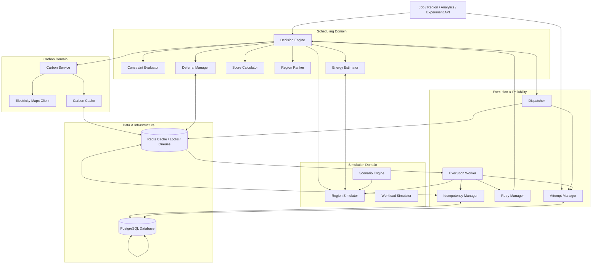

# Component Design

This document defines the module specifications, interfaces, inputs/outputs, dependencies, and boundaries within the EcoRoute modular monolith backend.

---

## 1. Component Specifications

### 1.1 API Layer

| Component | Purpose & Responsibilities | Inputs | Outputs | Dependencies | Non-Responsibilities |
| :--- | :--- | :--- | :--- | :--- | :--- |
| **Job API** | Validates inbound workloads via Pydantic; persists initial `PENDING` Job; exposes lifecycle status. | Submission JSON (CPU, RAM, duration, priority, deadline) | HTTP responses, `Job` / `JobAttempt` models | Decision Engine, Attempt Manager, PostgreSQL | Feasibility checks, $J_r$ scoring, direct DB mutations |
| **Region API** | Exposes simulated region topology, hardware specs, utilization, and network latency for UI. | Filter query parameters | Region telemetry snapshots | Region Simulator, PostgreSQL | Modifying simulator state, calculating scores |
| **Analytics API** | Serves carbon savings KPIs, counterfactual benchmarks, and paginated audit records. | Date ranges, metric filters | Aggregated analytics, audit logs | Audit Service, Metrics Service, PostgreSQL | Real-time scheduling, mutating audit records |
| **Experiment API** | Ingests benchmark configs (seeds, scenarios, variants); triggers runs and exposes results. | Experiment configuration JSON | Run status, `ExperimentResult` datasets | Experiment Engine, PostgreSQL | Executing simulation loops, running schedulers |

---

### 1.2 Scheduling Domain

| Component | Purpose & Responsibilities | Inputs | Outputs | Dependencies | Non-Responsibilities |
| :--- | :--- | :--- | :--- | :--- | :--- |
| **Decision Engine** | Central orchestrator coordinating signal collection, constraint pruning, scoring, and execute/defer actions. | Validated `Job`, environmental signals | `SchedulingDecision` (winning region, rankings, action) | Constraint Evaluator, Energy Estimator, Carbon Service, Score Calculator, Region Ranker, Deferral Manager, PostgreSQL | Direct execution, raw HTTP API calls, carbon fabrication, retry routing |
| **Constraint Evaluator** | First-stage filter enforcing availability, CPU/RAM capacity, and hard deadlines ($t_{\text{now}} + T_r + L_r \le t_{\text{deadline}}$). | Job demand, live Region state | Set of `Feasible Regions` | Region Simulator | Multi-objective scoring, carbon evaluation, soft preferences |
| **Energy Estimator** | Deterministic power scaling: $T_r = \frac{T_{\text{base}}}{\text{Perf}_r}$, $\Delta P = P(U_{\text{after}}) - P(U_{\text{before}})$, $E_r = \Delta P \times T_r$. | Workload profile, Region power specs ($P_{\text{idle}}, P_{\text{peak}}$), $T_r$ | Predicted $E_r$ (kWh) per feasible region | Region Simulator | Carbon calculations, region selection, physical wattmeter claims |
| **Score Calculator** | Computes normalized cost $J_r = w_C N(E_r \times CI_r) + w_T N(T_r) + w_U N(U_r) + w_L N(L_r)$ where $\sum w = 1.0$. | Feasible regions, $E_r, CI_r, T_r, U_r, L_r$, weights | Map of Region IDs to $J_r$ scores and sub-factors | Pure domain calculation | Final region selection, dispatching jobs, deciding deferral |
| **Region Ranker** | Orders candidate regions in ascending order of $J_r$ with deterministic tie-breaking. | Feasible regions + $J_r$ scores | Ordered list of candidate regions | Pure domain calculation | Dispatching workloads, modifying scores |
| **Deferral Manager** | Evaluates deadline slack and green forecast windows ($J_{\text{future}} < J_{\text{current}} - \epsilon$) to emit `EXECUTE` or `DEFER`. | Ranked regions, deadline, priority, forecast | Action (`EXECUTE` / `DEFER`), wakeup trigger | Redis, PostgreSQL | Static fixed sleep loops, overriding hard deadlines |

---

### 1.3 Simulation Domain

| Component | Purpose & Responsibilities | Inputs | Outputs | Dependencies | Non-Responsibilities |
| :--- | :--- | :--- | :--- | :--- | :--- |
| **Region Simulator** | Models dynamic capacity, utilization ($U_r$), availability, power specs, and latency with deterministic seed support. | Region profiles, simulation ticks, seeds | Region telemetry snapshots | None | Carbon intensity integration, placement decisions |
| **Workload Simulator** | Generates standardized, repeatable workload profiles (CPU, RAM, $T_{\text{base}}$, priority, deadline). | Workload distribution configs, seeds | Workload specification objects | None | Regional hardware state, placement decisions |
| **Scenario Engine** | Generates controlled environmental perturbations (congestion, grid swings, node failures). | Scenario configs, simulation clock | Operational mutations applied to Simulator | Region Simulator | Direct workload execution, mutating production decisions |

---

### 1.4 Carbon Domain

| Component | Purpose & Responsibilities | Inputs | Outputs | Dependencies | Non-Responsibilities |
| :--- | :--- | :--- | :--- | :--- | :--- |
| **Carbon Service** | Authoritative carbon interface; validates observation freshness and enforces fallback hierarchy (Live $\to$ Cache $\to$ Bypass). | Region ID / coordinates | `CarbonObservation` (CI, source, quality flag) | Electricity Maps Client, Carbon Cache, PostgreSQL | Fabricating values, calculating $J_r$ scores |
| **Electricity Maps Client** | HTTP client handling authentication, rate limiting, and deserialization against Electricity Maps. | Region query parameters | Raw external carbon intensity payload | Electricity Maps API | Caching observations, fallback logic |
| **Carbon Cache** | In-memory TTL caching of validated observations in Redis. | Validated `CarbonObservation`, TTL | Cached observation (or cache miss) | Redis | Direct API querying, synthesizing data |

---

### 1.5 Execution & Reliability Domain

| Component | Purpose & Responsibilities | Inputs | Outputs | Dependencies | Non-Responsibilities |
| :--- | :--- | :--- | :--- | :--- | :--- |
| **Dispatcher** | Converts `SchedulingDecision(EXECUTE)` into `JobAttempt(PENDING)`, locks region, enqueues to Redis. | `SchedulingDecision` | `JobAttempt`, Redis queue task | Attempt Manager, PostgreSQL, Redis | Rerunning selection, executing task code |
| **Execution Worker** | Atomically claims attempts, runs simulation loop, updates state (`CLAIMED` $\to$ `RUNNING` $\to$ `COMPLETED`/`FAILED`). | Redis queue task (`job_id`, `attempt_id`) | Execution telemetry, completion status | Idempotency Manager, Region Simulator, Attempt Manager, PostgreSQL | Selecting fallback regions on failure |
| **Attempt Manager** | Manages `JobAttempt` state machine and decouples logical `Job` from concrete runs. | Attempt creation/transition requests | Persisted `JobAttempt` records | PostgreSQL | Scheduling decisions, worker task execution |
| **Retry Manager** | Handles failed attempts, verifies retry policy ($N < N_{\text{max}}$) and slack, triggers fresh routing in Decision Engine. | Failed `JobAttempt` | Fresh scheduling request or terminal `FAILED` | Decision Engine, Attempt Manager, PostgreSQL | Blindly reusing previous region, running attempts |
| **Idempotency Manager** | Enforces atomic claims via Redis mutex (`SET NX PX`) and PostgreSQL conditional updates (`WHERE status='PENDING'`). | Worker claim requests | Claim decision (`APPROVED` / `REJECTED`) | Redis, PostgreSQL | Scheduling logic, payload parsing |

---

### 1.6 Analytics & Experiments Domain

| Component | Purpose & Responsibilities | Inputs | Outputs | Dependencies | Non-Responsibilities |
| :--- | :--- | :--- | :--- | :--- | :--- |
| **Audit Service** | Immutable ledger logging all intakes, decisions, constraint rejections, claims, completions, and retries. | Domain events | Persisted `AuditRecord` rows | PostgreSQL | Modifying domain state, scoring logic |
| **Metrics Service** | Aggregates energy, emissions, carbon savings %, SLA compliance, and latency metrics. | Persisted jobs, attempts, decisions | Structured analytical metrics | PostgreSQL | Real-time scheduling, modifying data |
| **Experiment Engine** | Runs benchmark harnesses across 5 scheduler variants (`CONVENTIONAL`, `RANDOM`, `CARBON_ONLY`, `PERFORMANCE_ONLY`, `ECOROUTE`). | Experiment configs, workloads, seeds | `ExperimentResult` datasets | Decision Engine, Region Simulator, Workload Simulator, Scenario Engine, PostgreSQL | Mutating live production state |

---

## 2. Component Interaction & Dependencies

---

## 3. Core Interaction Flows

### 3.1 Normal Scheduling & Execution
1. **Client $\to$ Job API**: Ingests and validates workload payload; creates `Job(PENDING)` in PostgreSQL.
2. **Job API $\to$ Decision Engine**: Collects regional telemetry from **Region Simulator** and filters non-viable regions via **Constraint Evaluator**.
3. **Decision Engine $\to$ Carbon / Energy**: Queries **Carbon Service** for $CI_r$ and **Energy Estimator** for $E_r$.
4. **Decision Engine $\to$ Scoring & Deferral**: **Score Calculator** computes $J_r$; **Region Ranker** sorts candidates; **Deferral Manager** approves immediate execution.
5. **Decision Engine $\to$ Dispatcher**: Creates `JobAttempt(PENDING)` in PostgreSQL; locks target region; pushes task to Redis queue.
6. **Execution Worker $\to$ Idempotency Manager**: Atomically claims attempt via database CAS update; runs simulated workload; records completion.

### 3.2 Carbon Fallback & Fail-Safe Routing
* If Electricity Maps is live and fresh: Observation is cached in Redis and passed to scheduler (`LIVE`).
* If Electricity Maps fails and Redis cache is valid: Cached observation is returned (`CACHED`).
* If both fail: Carbon optimization is bypassed ($w_C = 0$); conventional operational scheduling executes (`UNAVAILABLE`). Carbon values are **never fabricated**.

### 3.3 Failure Recovery & Retry
* On worker execution error: **Retry Manager** checks remaining retry quota and deadline slack.
* If eligible: **Retry Manager** invokes **Decision Engine** for a fresh evaluation under current real-time conditions; a new `attempt_id` is created.
* Previous regions are never blindly reused.

### 3.4 Duplicate Delivery Prevention (Atomic Claim)
* Parallel workers attempting to claim the same `attempt_id` compete via conditional update:
  `UPDATE job_attempts SET status='CLAIMED', claimed_by=:worker WHERE id=:id AND status='PENDING'`
* Exactly one worker receives `1 row affected` and proceeds; losing workers receive `0 rows` and drop the duplicate task as a no-op.

---

## 4. Component Boundary Summary

| Component | Owns | Does Not Own |
| :--- | :--- | :--- |
| **Job API** | Workload intake & validation | Scheduling algorithms & scoring |
| **Decision Engine** | Scheduling orchestration | Direct execution & DB transactions |
| **Constraint Evaluator** | Hard feasibility filtering | Scoring & soft preferences |
| **Energy Estimator** | Workload energy modeling ($E_r$) | Carbon calculations & region selection |
| **Carbon Service** | Carbon data & fallback hierarchy | Value fabrication & scoring |
| **Score Calculator** | Normalized $J_r$ score computation | Dispatch, deferral & region selection |
| **Region Ranker** | Candidate ordering & tie-breaking | Task dispatch & execution |
| **Deferral Manager** | Execute vs. Defer decisions | Execution & static sleep loops |
| **Region Simulator** | Simulated regional state | Carbon data & scheduling logic |
| **Dispatcher** | Attempt creation & dispatch | Region selection & task execution |
| **Execution Worker** | Simulated task execution | Retry routing & region selection |
| **Retry Manager** | Failure recovery & retry policy | Direct execution & static retries |
| **Idempotency Manager** | Atomic attempt claim enforcement | Scheduling & payload handling |
| **Audit Service** | Immutable event logging | Domain decision logic |
| **Experiment Engine** | Benchmark scenario execution | Production state mutation |
