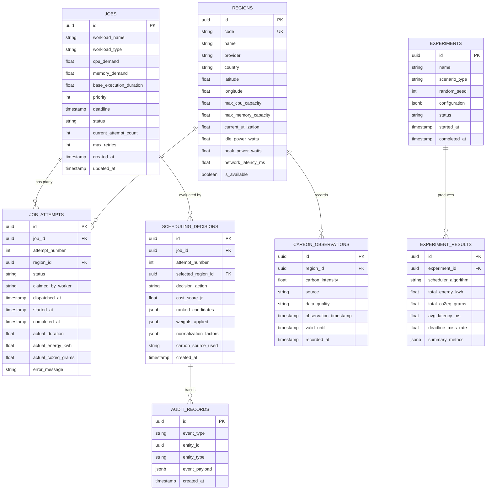
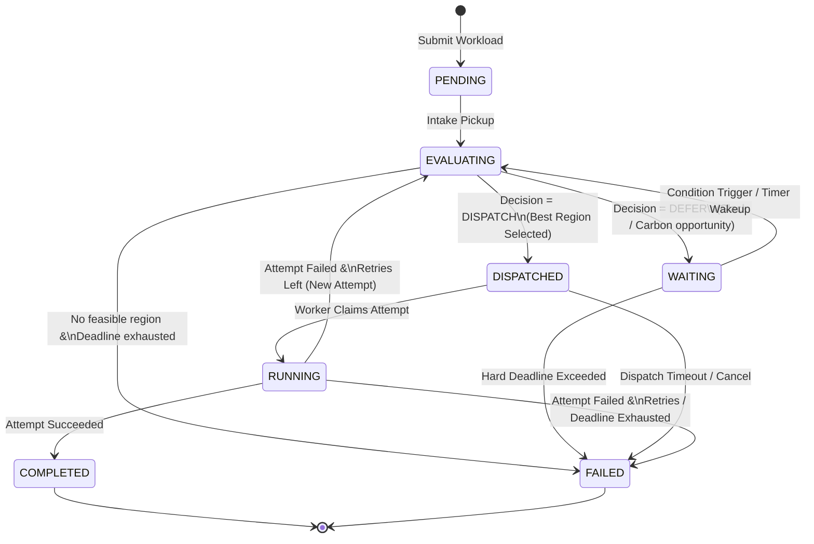
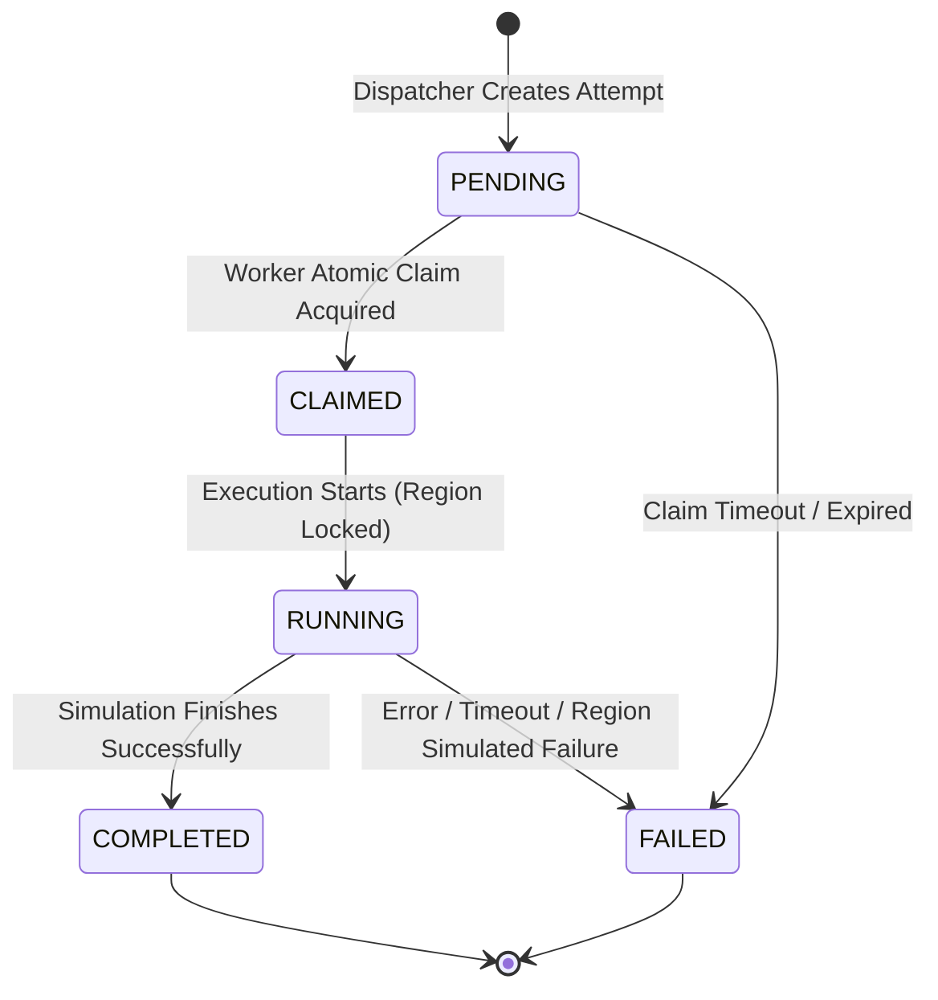

# Data Architecture

This document defines the persistent data model, state machines, and caching architecture for EcoRoute.

---

## 1. Storage Tier Separation

EcoRoute strictly separates persistent storage from operational caching and transient synchronization:

```text
┌────────────────────────────────────────────────────────────────────────┐
│                        PostgreSQL Database                            │
│  - Durable Source of Truth                                             │
│  - ACID Transactions & Foreign Key Integrity                           │
│  - Stores Jobs, Attempts, Decisions, Regions, Audits, Experiments       │
└──────────────────────────────────┬─────────────────────────────────────┘
                                   │ (Sync / State Updates)
┌──────────────────────────────────┴─────────────────────────────────────┐
│                           Redis Cache & Broker                         │
│  - Short-Lived Carbon Intensity Observations (TTL Caching)             │
│  - Distributed Locks for Atomic Attempt Claims (SET NX PX)             │
│  - Transient Deferral Timers & Worker Coordination Queues              │
└────────────────────────────────────────────────────────────────────────┘
```

---

## 2. Core Relational Schema (PostgreSQL)



---

## 3. State Machines

### 3.1 Logical Job State Machine

The `Job` state machine tracks the lifecycle of the computational workload across one or more execution attempts.



### 3.2 Physical / Simulated Job Attempt State Machine

The `JobAttempt` state machine tracks an isolated execution run within a locked target region.



---

## 4. State Ownership and Transition Rules

1. **Job vs. Attempt Isolation**:
   * A `Job` represents the logical task and durable lifecycle.
   * A `JobAttempt` represents a single, region-locked execution attempt.
   * If an attempt fails, the attempt is marked `FAILED` and is never re-opened. The parent `Job` returns to `EVALUATING` so that the Decision Engine can make a brand-new routing determination.
2. **Atomic State Mutations**:
   * Transition from `JobAttempt(PENDING)` to `JobAttempt(CLAIMED)` must be strictly guarded by an atomic database CAS update (`WHERE status = 'PENDING'`) backed by a distributed mutex lock in Redis.
3. **Region Locking**:
   * Once a `JobAttempt` enters `CLAIMED` / `RUNNING`, the assigned region is locked for that specific attempt. Mid-execution live migrations across simulated regions are explicitly disallowed.
4. **Terminal States**:
   * `COMPLETED` and `FAILED` are terminal states for both `Job` and `JobAttempt`.
