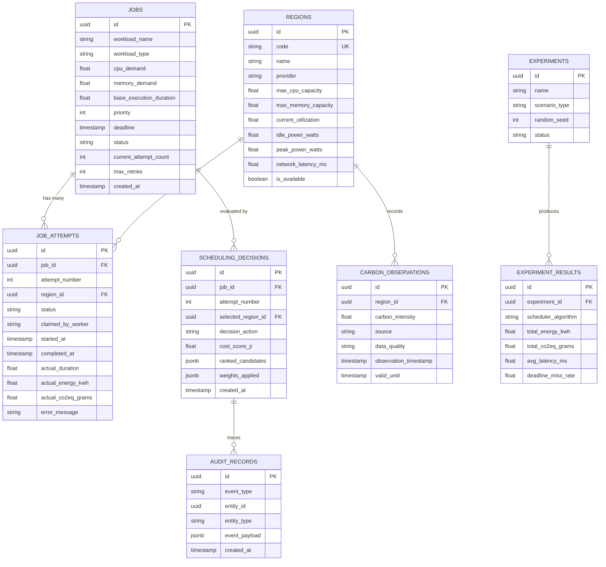
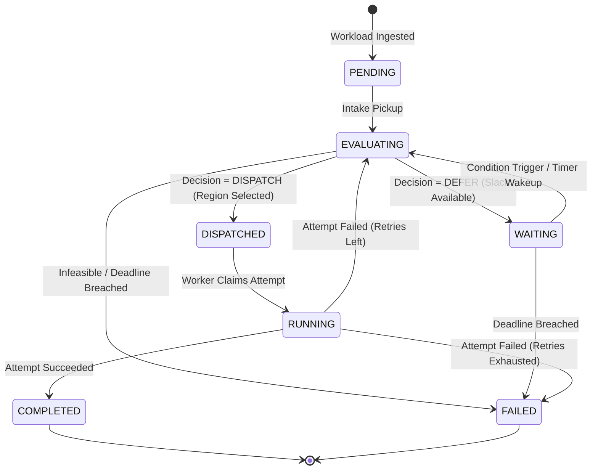
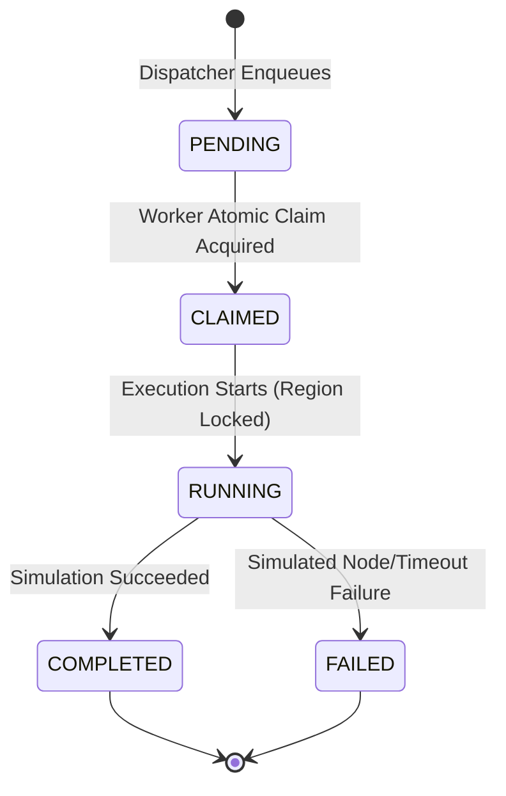

# Data Architecture

This document defines the relational data model, state machines, and persistence boundaries for EcoRoute.

---

## 1. Storage Tier Separation

```text
┌────────────────────────────────────────────────────────────────────────┐
│                        PostgreSQL Database                            │
│  - Durable Source of Truth (ACID Transactions & Foreign Keys)          │
│  - Stores: Jobs, Job Attempts, Decisions, Regions, Audits, Experiments │
└──────────────────────────────────┬─────────────────────────────────────┘
                                   │
┌──────────────────────────────────┴─────────────────────────────────────┐
│                           Redis Cache & Broker                         │
│  - Short-Lived Carbon Observations (TTL Caching)                       │
│  - Distributed Mutex Locks for Atomic Attempt Claims (SET NX PX)       │
│  - Transient Deferral Signals & Dispatch Queues                        │
└────────────────────────────────────────────────────────────────────────┘
```

---

## 2. Core Relational Schema (PostgreSQL)



---

## 3. State Machines

### 3.1 Logical Job State Machine



### 3.2 Physical / Simulated Attempt State Machine



---

## 4. State Rules

1. **Job vs. Attempt Isolation**: A `Job` tracks the full lifecycle across retries. A `JobAttempt` tracks an immutable single run in a locked region. Failed attempts are marked `FAILED` and never modified.
2. **Atomic Transitions**: `JobAttempt(PENDING)` $\to$ `JobAttempt(CLAIMED)` requires an atomic database CAS update (`WHERE status = 'PENDING'`) backed by a Redis mutex lock (`SET NX PX`).
3. **Region Locking**: Once an attempt enters `CLAIMED`/`RUNNING`, its target region is locked for the life of that attempt.
