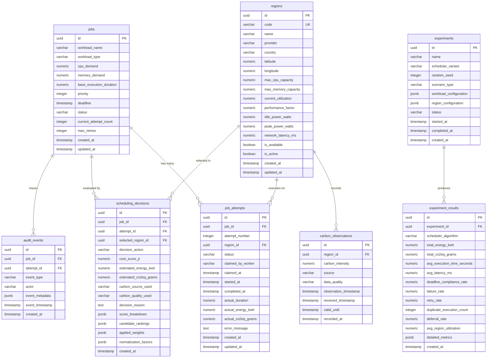

# Database Design

This document defines the logical database design for **EcoRoute**, specifying the relational entities, schema constraints, indexes, state persistence, atomic claiming mechanisms, and transactional boundaries to be implemented in Supabase PostgreSQL via SQLAlchemy.

---

## 1. Technology & Persistence Architecture

* **Database Engine**: PostgreSQL 16+
* **Managed Provider**: Supabase
* **ORM / Query Layer**: SQLAlchemy 2.0 (AsyncIO)

```text
Next.js 16 Frontend
        │
        ▼ (HTTPS REST / WebSockets)
FastAPI Backend (Modular Monolith)
        │
        ▼ (SQLAlchemy Async Engine)
Supabase PostgreSQL (Authoritative Source of Truth)
```

* **Data Authority**: PostgreSQL is the single durable source of truth.
* **Role of Redis**: Redis provides auxiliary, non-authoritative support for short-lived carbon observation caching (`TTL`), distributed locks (`SET NX PX`), and task coordination queues. Redis failures must never corrupt or destroy authoritative system state.

---

## 2. Entity-Relationship Diagram



---

## 3. Logical Table Specifications

### 3.1 `jobs`
* **Purpose**: Persists the logical workload submitted to EcoRoute across its entire lifecycle.

| Column | Data Type | Nullable | Default | Constraints / Descriptions |
| :--- | :--- | :--- | :--- | :--- |
| `id` | `UUID` | No | `gen_random_uuid()` | Primary Key |
| `workload_name` | `VARCHAR(255)` | No | — | Human-readable workload identifier |
| `workload_type` | `VARCHAR(100)` | No | — | E.g., `BATCH`, `INFERENCE`, `TRAINING` |
| `cpu_demand` | `NUMERIC(8,2)` | No | — | CPU cores required (`> 0`) |
| `memory_demand` | `NUMERIC(10,2)` | No | — | RAM in GB required (`> 0`) |
| `base_execution_duration` | `NUMERIC(10,2)` | No | — | Base runtime in seconds ($T_{\text{base}} > 0$) |
| `priority` | `INTEGER` | No | `1` | Workload priority level ($1 \le \text{priority} \le 10$) |
| `deadline` | `TIMESTAMPTZ` | No | — | Hard SLA deadline constraint |
| `status` | `VARCHAR(50)` | No | `'PENDING'` | `PENDING`, `EVALUATING`, `WAITING`, `DISPATCHED`, `RUNNING`, `COMPLETED`, `FAILED` |
| `current_attempt_count` | `INTEGER` | No | `0` | Number of execution attempts initiated ($\ge 0$) |
| `max_retries` | `INTEGER` | No | `3` | Maximum allowed retry attempts ($\ge 0$) |
| `created_at` | `TIMESTAMPTZ` | No | `CURRENT_TIMESTAMP` | Ingestion timestamp |
| `updated_at` | `TIMESTAMPTZ` | No | `CURRENT_TIMESTAMP` | Last modification timestamp |

---

### 3.2 `job_attempts`
* **Purpose**: Persists a single execution attempt of a logical Job in a locked target region.

| Column | Data Type | Nullable | Default | Constraints / Descriptions |
| :--- | :--- | :--- | :--- | :--- |
| `id` | `UUID` | No | `gen_random_uuid()` | Primary Key |
| `job_id` | `UUID` | No | — | Foreign Key $\to$ `jobs(id)` ON DELETE CASCADE |
| `attempt_number` | `INTEGER` | No | `1` | 1-indexed attempt sequence number ($\ge 1$) |
| `region_id` | `UUID` | No | — | Foreign Key $\to$ `regions(id)` (Target region locked for attempt) |
| `status` | `VARCHAR(50)` | No | `'PENDING'` | `PENDING`, `CLAIMED`, `RUNNING`, `COMPLETED`, `FAILED` |
| `claimed_by_worker` | `VARCHAR(255)` | Yes | `NULL` | Identifier of worker holding atomic claim |
| `claimed_at` | `TIMESTAMPTZ` | Yes | `NULL` | Timestamp when atomic claim was secured |
| `started_at` | `TIMESTAMPTZ` | Yes | `NULL` | Timestamp when simulation execution started |
| `completed_at` | `TIMESTAMPTZ` | Yes | `NULL` | Timestamp when attempt completed or failed |
| `actual_duration` | `NUMERIC(10,2)` | Yes | `NULL` | Measured/simulated duration in seconds |
| `actual_energy_kwh` | `NUMERIC(12,6)` | Yes | `NULL` | Measured/simulated energy in kWh |
| `actual_co2eq_grams` | `NUMERIC(12,4)` | Yes | `NULL` | Measured/simulated emissions in grams $\text{CO}_2\text{eq}$ |
| `error_message` | `TEXT` | Yes | `NULL` | Failure forensics / stack trace snippet |
| `created_at` | `TIMESTAMPTZ` | No | `CURRENT_TIMESTAMP` | Attempt generation timestamp |
| `updated_at` | `TIMESTAMPTZ` | No | `CURRENT_TIMESTAMP` | Last modification timestamp |

* **Unique Constraint**: `UNIQUE(job_id, attempt_number)`

---

### 3.3 `regions`
* **Purpose**: Persists logical/simulated cloud execution targets and reference hardware/power models.

| Column | Data Type | Nullable | Default | Constraints / Descriptions |
| :--- | :--- | :--- | :--- | :--- |
| `id` | `UUID` | No | `gen_random_uuid()` | Primary Key |
| `code` | `VARCHAR(50)` | No | — | Unique region code (e.g., `aws-us-east-1`, `gcp-europe-west1`) |
| `name` | `VARCHAR(255)` | No | — | Human-readable region label |
| `provider` | `VARCHAR(50)` | No | — | Reference provider: `AWS`, `AZURE`, `GCP` |
| `country` | `VARCHAR(100)` | No | — | Geographic country code / location |
| `latitude` | `NUMERIC(9,6)` | No | — | Geographic latitude coordinate |
| `longitude` | `NUMERIC(9,6)` | No | — | Geographic longitude coordinate |
| `max_cpu_capacity` | `NUMERIC(8,2)` | No | — | Total simulated CPU capacity ($> 0$) |
| `max_memory_capacity` | `NUMERIC(10,2)` | No | — | Total simulated RAM in GB ($> 0$) |
| `current_utilization` | `NUMERIC(5,4)` | No | `0.0` | Simulated utilization ($0.0 \le U \le 1.0$) |
| `performance_factor` | `NUMERIC(6,4)` | No | `1.0` | Speedup multiplier relative to base ($> 0$) |
| `idle_power_watts` | `NUMERIC(8,2)` | No | — | Static baseline power draw $P_{\text{idle}} \ge 0$ |
| `peak_power_watts` | `NUMERIC(8,2)` | No | — | Peak workload power draw $P_{\text{peak}} \ge P_{\text{idle}}$ |
| `network_latency_ms` | `NUMERIC(8,2)` | No | — | Baseline simulated network latency $L_r \ge 0$ |
| `is_available` | `BOOLEAN` | No | `TRUE` | Regional operational health flag |
| `is_active` | `BOOLEAN` | No | `TRUE` | Administrative participation flag |
| `created_at` | `TIMESTAMPTZ` | No | `CURRENT_TIMESTAMP` | Record creation timestamp |
| `updated_at` | `TIMESTAMPTZ` | No | `CURRENT_TIMESTAMP` | Last modification timestamp |

* **Unique Constraint**: `UNIQUE(code)`

---

### 3.4 `carbon_observations`
* **Purpose**: Durable record of real and cached carbon-intensity observations fetched for regions.

| Column | Data Type | Nullable | Default | Constraints / Descriptions |
| :--- | :--- | :--- | :--- | :--- |
| `id` | `UUID` | No | `gen_random_uuid()` | Primary Key |
| `region_id` | `UUID` | No | — | Foreign Key $\to$ `regions(id)` ON DELETE CASCADE |
| `carbon_intensity` | `NUMERIC(8,2)` | Yes | `NULL` | Value in $g\text{CO}_2\text{eq}/\text{kWh}$ (NULL if UNAVAILABLE) |
| `source` | `VARCHAR(100)` | No | — | `ELECTRICITY_MAPS`, `REGIONAL_PROFILE` |
| `data_quality` | `VARCHAR(50)` | No | — | `LIVE`, `CACHED`, `UNAVAILABLE` |
| `observation_timestamp`| `TIMESTAMPTZ` | No | — | Timestamp of emission measurement at grid source |
| `received_timestamp` | `TIMESTAMPTZ` | No | `CURRENT_TIMESTAMP` | Timestamp when backend fetched observation |
| `valid_until` | `TIMESTAMPTZ` | No | — | Cache TTL / validity boundary timestamp |
| `recorded_at` | `TIMESTAMPTZ` | No | `CURRENT_TIMESTAMP` | Database insertion timestamp |

> [!IMPORTANT]
> **No Fabricated Data**: If trustworthy carbon data cannot be obtained, `data_quality` is recorded as `'UNAVAILABLE'` and `carbon_intensity` is stored as `NULL`. Fabricated numerical values are strictly prohibited.

---

### 3.5 `scheduling_decisions`
* **Purpose**: Persists scheduler evaluations, scoring factors ($J_r$), regional rankings, and explainability breakdowns.

| Column | Data Type | Nullable | Default | Constraints / Descriptions |
| :--- | :--- | :--- | :--- | :--- |
| `id` | `UUID` | No | `gen_random_uuid()` | Primary Key |
| `job_id` | `UUID` | No | — | Foreign Key $\to$ `jobs(id)` ON DELETE CASCADE |
| `attempt_id` | `UUID` | Yes | `NULL` | Foreign Key $\to$ `job_attempts(id)` (if action is `EXECUTE`) |
| `selected_region_id` | `UUID` | Yes | `NULL` | Foreign Key $\to$ `regions(id)` (Winning region, NULL if deferred) |
| `decision_action` | `VARCHAR(50)` | No | — | `EXECUTE`, `DEFER`, `REJECT` |
| `cost_score_jr` | `NUMERIC(8,6)` | Yes | `NULL` | Final composite score $J_r$ of winning region |
| `estimated_energy_kwh`| `NUMERIC(12,6)`| Yes | `NULL` | Estimated energy $E_r$ for selected region |
| `estimated_co2eq_grams`| `NUMERIC(12,4)`| Yes | `NULL` | Estimated emissions for selected region |
| `carbon_source_used` | `VARCHAR(100)` | No | — | Provider string or `NONE` |
| `carbon_quality_used`| `VARCHAR(50)` | No | — | `LIVE`, `CACHED`, `UNAVAILABLE` |
| `decision_reason` | `TEXT` | No | — | Rationale string explaining selection or deferral |
| `score_breakdown` | `JSONB` | No | — | Sub-score components for winning region |
| `candidate_rankings` | `JSONB` | No | — | Full ordered list of all evaluated candidate regions |
| `applied_weights` | `JSONB` | No | — | Weights applied: `{"w_C": 0.4, "w_T": 0.3, "w_U": 0.2, "w_L": 0.1}` |
| `normalization_factors`| `JSONB` | No | — | Min/Max bounds used for feature scaling |
| `created_at` | `TIMESTAMPTZ` | No | `CURRENT_TIMESTAMP` | Decision evaluation timestamp |

#### Structured JSONB Schemas:
* **`score_breakdown`**:
  ```json
  {
    "carbon_subscore": 0.1842,
    "time_subscore": 0.2450,
    "utilization_subscore": 0.0920,
    "latency_subscore": 0.0410,
    "total_jr": 0.5622
  }
  ```
* **`applied_weights`**:
  ```json
  {
    "w_C": 0.40,
    "w_T": 0.30,
    "w_U": 0.20,
    "w_L": 0.10
  }
  ```
* **`candidate_rankings`**:
  ```json
  [
    {
      "rank": 1,
      "region_id": "8f8832a8-1234-4b55-b001-f1a23456789a",
      "region_code": "aws-us-east-1",
      "jr_score": 0.5622,
      "feasible": true
    },
    {
      "rank": 2,
      "region_id": "9b1234a8-5678-4c99-a002-c9d87654321b",
      "region_code": "gcp-europe-west1",
      "jr_score": 0.6841,
      "feasible": true
    }
  ]
  ```

---

### 3.6 `experiments`
* **Purpose**: Defines standardized configuration harnesses for reproducible scheduling benchmark runs.

| Column | Data Type | Nullable | Default | Constraints / Descriptions |
| :--- | :--- | :--- | :--- | :--- |
| `id` | `UUID` | No | `gen_random_uuid()` | Primary Key |
| `name` | `VARCHAR(255)` | No | — | Benchmark experiment name |
| `scheduler_variant` | `VARCHAR(50)` | No | — | `CONVENTIONAL`, `RANDOM`, `CARBON_ONLY`, `PERFORMANCE_ONLY`, `ECOROUTE` |
| `random_seed` | `INTEGER` | No | — | Deterministic random seed for workload/simulation generation |
| `scenario_type` | `VARCHAR(100)` | No | — | E.g., `BASELINE`, `GRID_SPIKE`, `NETWORK_CONGESTION` |
| `workload_configuration`| `JSONB` | No | — | Workload generation batch definition |
| `region_configuration` | `JSONB` | No | — | Active simulated region configuration set |
| `status` | `VARCHAR(50)` | No | `'PENDING'` | `PENDING`, `RUNNING`, `COMPLETED`, `FAILED` |
| `started_at` | `TIMESTAMPTZ` | Yes | `NULL` | Benchmark run start time |
| `completed_at` | `TIMESTAMPTZ` | Yes | `NULL` | Benchmark run completion time |
| `created_at` | `TIMESTAMPTZ` | No | `CURRENT_TIMESTAMP` | Record creation timestamp |

---

### 3.7 `experiment_results`
* **Purpose**: Persists aggregate academic evaluation metrics produced by experiment runs.

| Column | Data Type | Nullable | Default | Constraints / Descriptions |
| :--- | :--- | :--- | :--- | :--- |
| `id` | `UUID` | No | `gen_random_uuid()` | Primary Key |
| `experiment_id` | `UUID` | No | — | Foreign Key $\to$ `experiments(id)` ON DELETE CASCADE |
| `scheduler_algorithm` | `VARCHAR(50)` | No | — | Algorithm variant executed |
| `total_energy_kwh` | `NUMERIC(14,6)`| No | — | Cumulative energy across workload set |
| `total_co2eq_grams` | `NUMERIC(14,4)`| No | — | Cumulative emissions in grams $\text{CO}_2\text{eq}$ |
| `avg_execution_time_seconds` | `NUMERIC(10,2)`| No | — | Mean job execution duration |
| `avg_latency_ms` | `NUMERIC(8,2)` | No | — | Mean network latency observed |
| `deadline_compliance_rate` | `NUMERIC(5,4)` | No | — | Ratio of workloads meeting hard deadline ($0.0 - 1.0$) |
| `failure_rate` | `NUMERIC(5,4)` | No | — | Ratio of attempts failing ($0.0 - 1.0$) |
| `retry_rate` | `NUMERIC(5,4)` | No | — | Ratio of jobs requiring retries ($0.0 - 1.0$) |
| `duplicate_execution_count` | `INTEGER` | No | `0` | Number of duplicate execution races ($\ge 0$, must be 0) |
| `deferral_rate` | `NUMERIC(5,4)` | No | — | Ratio of jobs deferred prior to run ($0.0 - 1.0$) |
| `avg_region_utilization` | `NUMERIC(5,4)` | No | — | Mean capacity utilization across active regions |
| `detailed_metrics` | `JSONB` | No | — | Per-job telemetry and counterfactual comparisons |
| `created_at` | `TIMESTAMPTZ` | No | `CURRENT_TIMESTAMP` | Record creation timestamp |

---

### 3.8 `audit_events`
* **Purpose**: Immutable event ledger recording lifecycle events, operational state transitions, and scheduling actions.

| Column | Data Type | Nullable | Default | Constraints / Descriptions |
| :--- | :--- | :--- | :--- | :--- |
| `id` | `UUID` | No | `gen_random_uuid()` | Primary Key |
| `job_id` | `UUID` | Yes | `NULL` | Foreign Key $\to$ `jobs(id)` ON DELETE SET NULL |
| `attempt_id` | `UUID` | Yes | `NULL` | Foreign Key $\to$ `job_attempts(id)` ON DELETE SET NULL |
| `event_type` | `VARCHAR(100)` | No | — | Defined system event classification |
| `actor` | `VARCHAR(100)` | No | `'SYSTEM'` | E.g., `SCHEDULER`, `WORKER_01`, `API_CLIENT` |
| `event_metadata` | `JSONB` | No | `'{}'` | Event-specific forensic telemetry payload |
| `event_timestamp` | `TIMESTAMPTZ` | No | `CURRENT_TIMESTAMP` | Event occurrence timestamp |
| `created_at` | `TIMESTAMPTZ` | No | `CURRENT_TIMESTAMP` | Database insertion timestamp |

#### Defined Event Types:
* `JOB_CREATED`, `DECISION_MADE`, `REGION_REJECTED`, `JOB_DEFERRED`, `JOB_WOKEN_UP`, `ATTEMPT_CREATED`, `ATTEMPT_CLAIMED`, `EXECUTION_STARTED`, `EXECUTION_COMPLETED`, `EXECUTION_FAILED`, `RETRY_CREATED`, `CARBON_FALLBACK_TRIGGERED`.

---

## 4. State Persistence Model

### 4.1 Logical Job State
* **Persisting Table**: `jobs.status`
* **Transitions**:
  1. `PENDING`: Initial state upon ingestion via Job API.
  2. `EVALUATING`: Picked up by Decision Engine for constraint and multi-objective scoring.
  3. `WAITING`: Deferral Manager holds workload due to available slack and expected green grid window.
  4. `DISPATCHED`: Candidate region selected and `JobAttempt` record created in `PENDING` state.
  5. `RUNNING`: Worker acquires atomic claim on attempt; job enters active simulation.
  6. `COMPLETED`: Workload attempt finishes successfully (terminal).
  7. `FAILED`: Workload attempt fails and retry budget or deadline slack is exhausted (terminal).

### 4.2 Physical / Simulated Attempt State
* **Persisting Table**: `job_attempts.status`
* **Transitions**:
  1. `PENDING`: Created by Dispatcher; enqueued for worker pickup.
  2. `CLAIMED`: Worker secures atomic claim; worker ID and timestamp recorded.
  3. `RUNNING`: Worker starts simulation loop; target region is locked.
  4. `COMPLETED`: Simulation execution finishes successfully (terminal).
  5. `FAILED`: Attempt encounters simulated hardware failure or timeout (terminal).

---

## 5. Atomic Claim & Concurrency Protection

To guarantee exactly-once execution per attempt, PostgreSQL enforces an atomic Compare-And-Swap (CAS) state transition.

```text
Worker A ──┐
           ├── PostgreSQL Atomic CAS Update ──► Attempt Record
Worker B ──┘
```

### 5.1 Claim Precondition
An attempt is claimable if and only if:
1. `job_attempts.status = 'PENDING'`
2. `job_attempts.claimed_by_worker IS NULL`

### 5.2 Atomic State Mutation
The executing worker executes a conditional update:
* Target: Row matching `attempt_id` where `status = 'PENDING'`.
* Mutation: Sets `status = 'CLAIMED'`, `claimed_by_worker = :worker_id`, `claimed_at = CURRENT_TIMESTAMP`.
* Outcome:
  * **Rows Affected = 1**: Worker successfully secured the claim; proceeds to execution.
  * **Rows Affected = 0**: Attempt has already been claimed by another worker; current worker safely drops the redundant task as a no-op.

### 5.3 Layered Concurrency Control
1. **PostgreSQL CAS (Authoritative)**: Guarantees correctness regardless of transport race conditions.
2. **Redis Mutex (Coordination Helper)**: Workers acquire `SET lock:attempt:<id> <worker_id> NX PX 5000` to prevent redundant database round-trips under high concurrency. Redis assists latency reduction but is never relied upon as the sole correctness authority.

---

## 6. Transactional Boundaries

| Operation | Atomic Transaction Scope | Invariants Enforced |
| :--- | :--- | :--- |
| **Job Intake** | `INSERT INTO jobs` $\to$ `INSERT INTO audit_events` | Job exists in `PENDING` state with audit record; rejection rollback if validation fails. |
| **Scheduling Decision & Dispatch** | `INSERT INTO scheduling_decisions` $\to$ `UPDATE jobs (status='DISPATCHED')` $\to$ `INSERT INTO job_attempts (status='PENDING')` $\to$ `INSERT INTO audit_events` | Attempt is never created without an accompanying immutable decision record and state transition. |
| **Atomic Attempt Claim** | `UPDATE job_attempts SET status='CLAIMED' WHERE id=:id AND status='PENDING'` $\to$ `UPDATE jobs SET status='RUNNING'` $\to$ `INSERT INTO audit_events` | A job cannot enter `RUNNING` status unless its attempt was claimed with exactly 1 row affected. |
| **Attempt Completion** | `UPDATE job_attempts SET status='COMPLETED', ...` $\to$ `UPDATE jobs SET status='COMPLETED'` $\to$ `INSERT INTO audit_events` | Job and Attempt achieve terminal completion simultaneously with finalized telemetry. |
| **Attempt Failure & Retry Trigger** | `UPDATE job_attempts SET status='FAILED', ...` $\to$ `UPDATE jobs SET status='EVALUATING', current_attempt_count = current_attempt_count + 1` $\to$ `INSERT INTO audit_events` | Failed attempt is permanently sealed as `FAILED`; parent Job increments attempt counter and returns to scheduling. |

---

## 7. Index Strategy

Indexes are strictly aligned with known query access patterns:

| Table | Index Columns | Purpose / Supported Access Pattern |
| :--- | :--- | :--- |
| `jobs` | `(status, deadline)` | Polling active/evaluating jobs and sorting by deadline urgency. |
| `jobs` | `(created_at DESC)` | Paginated job list in UI dashboard. |
| `job_attempts` | `(job_id, attempt_number)` | Unique constraint index; fast retrieval of all attempts for a logical job. |
| `job_attempts` | `(status, region_id)` | Finding pending/running attempts by region for capacity accounting. |
| `regions` | `(code)` | Unique constraint index; lookup by cloud region identifier. |
| `regions` | `(is_available, is_active)` | Filtering active candidate regions during constraint evaluation. |
| `carbon_observations` | `(region_id, observation_timestamp DESC)` | Retrieving latest carbon observation for a specific region. |
| `carbon_observations` | `(valid_until)` | Background cleanup / invalidation of expired observations. |
| `scheduling_decisions`| `(job_id, created_at DESC)` | Retrieving latest decision history for a specific job. |
| `experiments` | `(status, created_at DESC)` | Experiment management and monitoring list. |
| `experiment_results` | `(experiment_id)` | Querying results and benchmarks associated with an experiment. |
| `audit_events` | `(job_id, event_timestamp DESC)` | Fetching complete audit trail for a specific workload. |
| `audit_events` | `(event_type, event_timestamp DESC)` | System-wide operational auditing and forensic queries. |

---

## 8. Integrity Constraints Summary

### 8.1 Domain Integrity
* **Job Limits**: `cpu_demand > 0`, `memory_demand > 0`, `base_execution_duration > 0`, `1 <= priority <= 10`, `max_retries >= 0`.
* **Region Limits**: `max_cpu_capacity > 0`, `max_memory_capacity > 0`, `0.0 <= current_utilization <= 1.0`, `performance_factor > 0`, `idle_power_watts >= 0`, `peak_power_watts >= idle_power_watts`, `network_latency_ms >= 0`.
* **Carbon Limits**: When `carbon_intensity IS NOT NULL`, `carbon_intensity >= 0`. Valid quality values are `'LIVE'`, `'CACHED'`, `'UNAVAILABLE'`.
* **Decision Scoring**: Total $J_r \ge 0$. Normalized sub-factors must satisfy $0.0 \le N(\cdot) \le 1.0$. Sum of weights in `applied_weights` must equal $1.0$.

### 8.2 Relational Integrity
* **Attempt Numbering**: `UNIQUE(job_id, attempt_number)`.
* **Region Codes**: `UNIQUE(code)`.
* **Referential Integrity**: Cascading deletes apply from `jobs` to child `job_attempts` and `scheduling_decisions`; foreign keys from `audit_events` use `ON DELETE SET NULL` to preserve historical audit logs if parent records are purged.

---

## 9. PostgreSQL vs. Redis Boundary

| Data Item | PostgreSQL Role | Redis Role |
| :--- | :--- | :--- |
| **Jobs & Lifecycle Status** | Authoritative Source of Truth | No |
| **Job Attempts & Execution Telemetry** | Authoritative Source of Truth | No |
| **Scheduling Decisions & Explanations** | Authoritative Source of Truth | No |
| **Region Specifications & Baseline Profiles** | Authoritative Source of Truth | No |
| **Historical Carbon Observations** | Authoritative Source of Truth | No |
| **Active Carbon Cache (TTL)** | No | Transient Key-Value Store (`TTL = 1800s`) |
| **Experiment Definitions & Benchmark Results**| Authoritative Source of Truth | No |
| **Audit Event Ledger** | Authoritative Source of Truth | No |
| **Worker Dispatch Queue** | No | Lightweight Transient Queue (`LPUSH` / `RPOPLPUSH`) |
| **Atomic Claim Mutex Locks** | No | Non-authoritative Speed Mutex (`SET NX PX`) |

> **Resilience Invariant**: If Redis crashes or flushes all keys, no authoritative business data is lost. PostgreSQL retains complete state, and active workers continue execution uninterrupted.

---

## 10. Data Retention & Historical Traceability

EcoRoute retains historical data permanently within the database to support academic benchmarking and compliance auditing:
* `scheduling_decisions` retains complete normalization factor sets and candidate rankings for deterministic counterfactual analysis.
* `audit_events` retains immutable timestamped records of all state machine transitions.
* `carbon_observations` preserves historical grid carbon variance for offline scheduler replay.

---

## 11. Design Validation Checklist

- [x] **FR1–FR10 Coverage**: Every functional requirement has durable schema support.
- [x] **Job / Attempt Separation**: Logical workload (`jobs`) is cleanly decoupled from physical execution attempts (`job_attempts`).
- [x] **Explainable Decisions**: `scheduling_decisions` stores full `score_breakdown`, `candidate_rankings`, `applied_weights`, and `normalization_factors` in structured JSONB fields.
- [x] **Zero Carbon Fabrication**: `carbon_observations` records source and quality flags; missing carbon data is persisted as `NULL` with quality `'UNAVAILABLE'`.
- [x] **PostgreSQL as Authoritative Source of Truth**: All state, attempts, decisions, and experiments are durably persisted in PostgreSQL.
- [x] **Redis Non-Authoritative Role**: Redis is strictly limited to transient caching, speed locks, and queues.
- [x] **Database-Enforced Atomic Claims**: PostgreSQL conditional CAS updates prevent duplicate attempt execution across concurrent workers.
- [x] **Isolated Retries**: Retries create incremented `attempt_number` entries with unique `attempt_id` values.
- [x] **Region Locking**: `job_attempts.region_id` is immutable once set, locking the region for the duration of the attempt.
- [x] **Reproducible Experiments**: `experiments` and `experiment_results` maintain frozen seed definitions and structured comparative metrics across all 5 benchmark scheduler variants.
