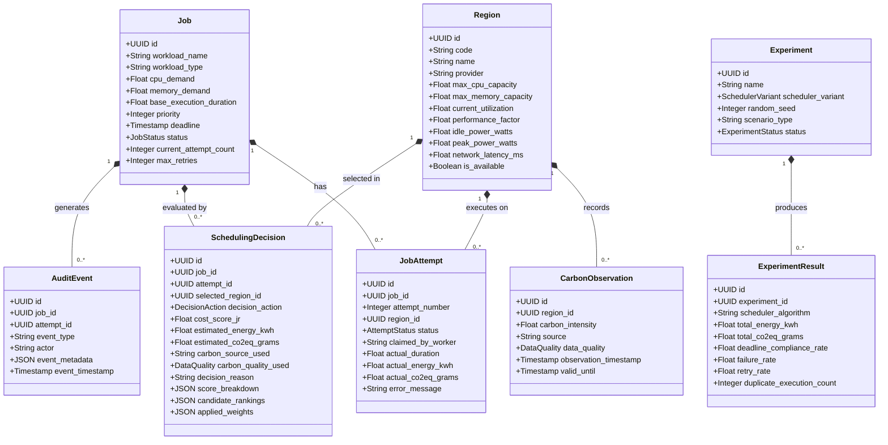

# Domain & Class Model Design

This document defines the core domain entities, aggregates, and application service boundaries for the EcoRoute modular monolith.

---

## 1. Domain Model Hierarchy

---

## 2. Core Domain Entities

* **`Job`**: Aggregate root representing a computational workload across its lifecycle. Owns requirements, priority, deadlines, and retry budgets.
* **`JobAttempt`**: Value entity representing an immutable single execution run locked to a specific target `Region`.
* **`Region`**: Aggregate representing a logical/simulated cloud execution target, its capacity, power curve, and operational health.
* **`CarbonObservation`**: Entity recording a time-bounded grid carbon intensity measurement ($g\text{CO}_2\text{eq}/\text{kWh}$) and its provenance (`LIVE`, `CACHED`, `UNAVAILABLE`).
* **`SchedulingDecision`**: Immutable evaluation entity capturing full explainability metrics, sub-scores, normalization bounds, candidate rankings, and actions (`EXECUTE` / `DEFER`).
* **`Experiment` & `ExperimentResult`**: Aggregate defining reproducible benchmark harnesses and comparative evaluation metrics across all 5 scheduler variants.
* **`AuditEvent`**: Immutable forensic log entry recording system-wide state machine transitions.

---

## 3. Domain & Application Services

| Service | Purpose & Boundary | Non-Responsibilities |
| :--- | :--- | :--- |
| **`SchedulingEngine`** | Orchestrates signal gathering, feasibility pruning, scoring, and execute/defer actions. | Direct workload execution, raw external API fetching |
| **`ConstraintEvaluator`** | First-stage filter dropping candidate regions violating capacity, availability, or deadlines. | Score computation, carbon optimization, soft preferences |
| **`EnergyEstimator`** | Deterministic mathematical modeling of workload power scaling and energy ($E_r$ in kWh). | Carbon emission calculation, region ranking |
| **`CarbonService`** | Resolves carbon intensity from Electricity Maps and cache; enforces zero-fabrication fallback. | Fabricating missing values, calculating $J_r$ scores |
| **`RegionSimulator`** | Maintains dynamic regional utilization, capacity, and latency under deterministic seed control. | Carbon data resolution, placement decisions |
| **`DeferralManager`** | Evaluates deadline slack and carbon forecast opportunities ($J_{\text{future}} < J_{\text{current}} - \epsilon$) to hold workloads in `WAITING`. | Arbitrary fixed sleep loops, overriding hard deadlines |
| **`Dispatcher`** | Converts approved decisions into `JobAttempt(PENDING)` records, locks the region, and enqueues to Redis. | Region selection, workload execution |
| **`ExecutionWorker`** | Claims attempt atomically, simulates workload execution in locked region, reports telemetry. | Selecting fallback regions on error, altering decisions |
| **`RetryManager`** | Verifies retry quota and deadline slack on failure; requests fresh routing from `SchedulingEngine`. | Blindly reusing previous region, executing tasks directly |
| **`IdempotencyManager`**| Guarantees exactly-once execution per attempt via PostgreSQL conditional CAS updates and Redis mutexes. | Scheduling intelligence, payload validation |
| **`ExperimentEngine`** | Executes benchmark scenarios across standardized baseline schedulers with frozen random seeds. | Modifying production scheduling state |
