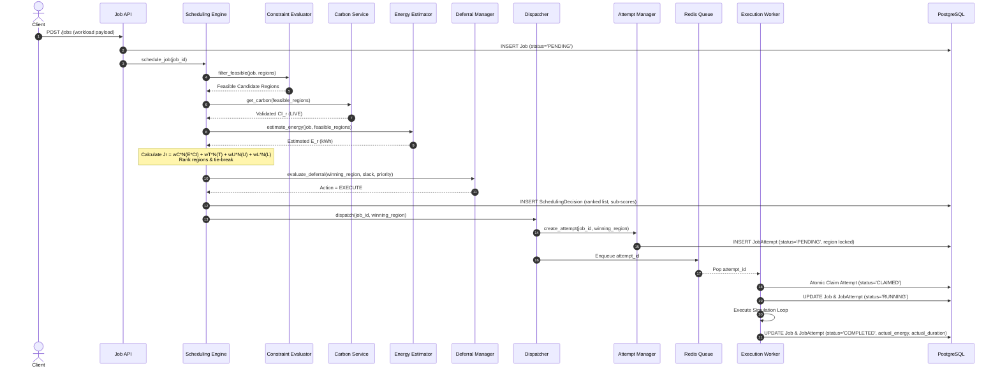
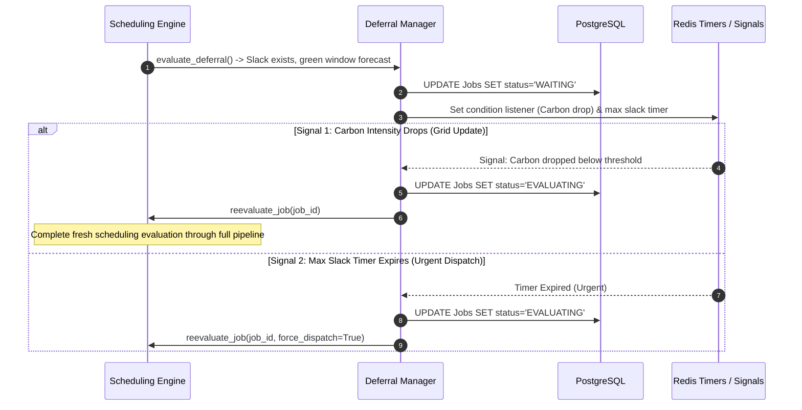
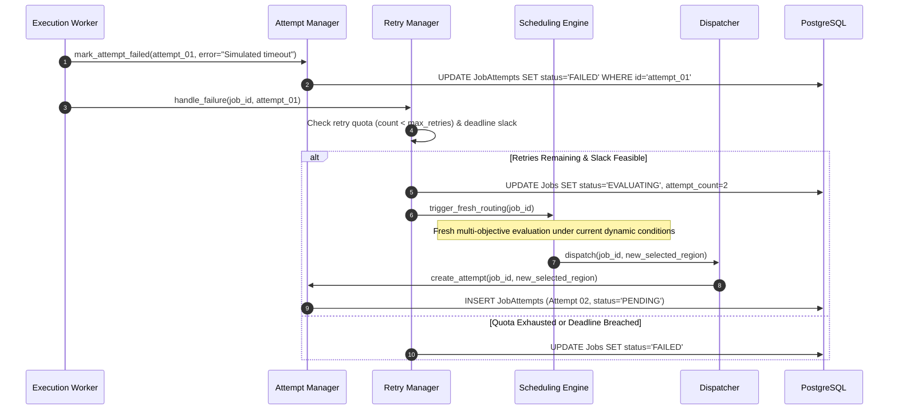
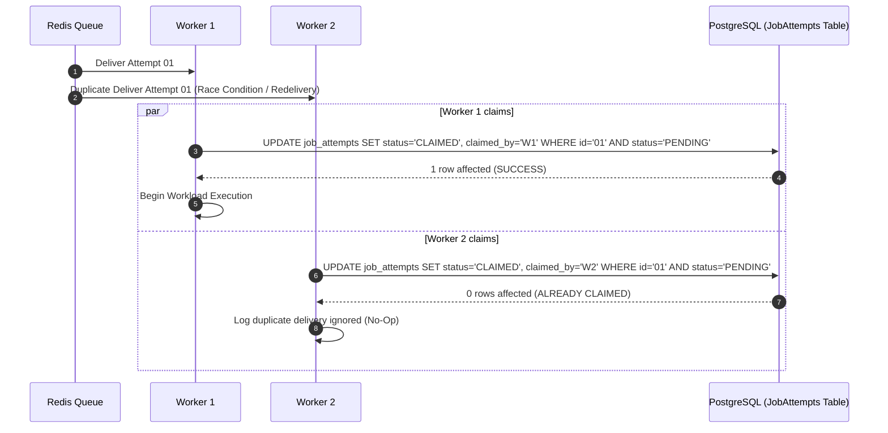

# Sequence & Interaction Design

This document details the runtime sequence interactions across the EcoRoute modular monolith for all major operational scenarios.

---

## 1. Normal Workload Scheduling & Execution

---

## 2. Deferred Workload & Condition-Based Wakeup

---

## 3. Failed Attempt Recovery & Fresh Central Re-routing

---

## 4. Duplicate Delivery Prevention (Atomic Claim Race)

