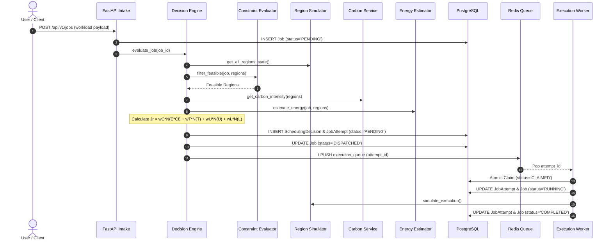
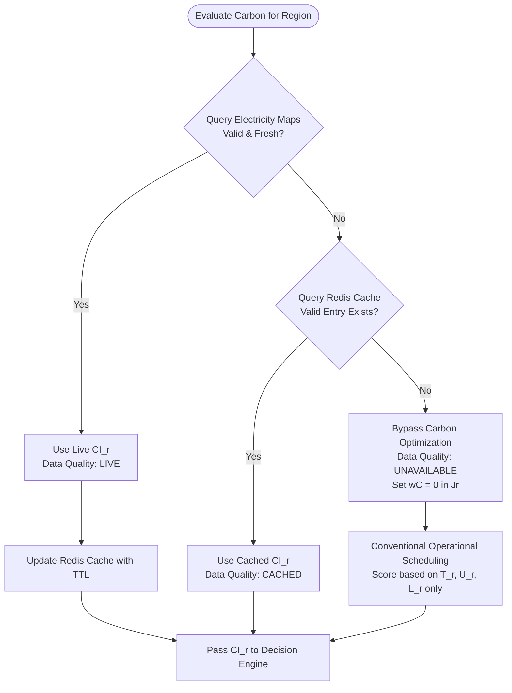
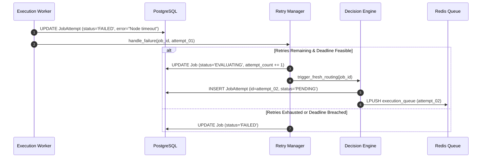
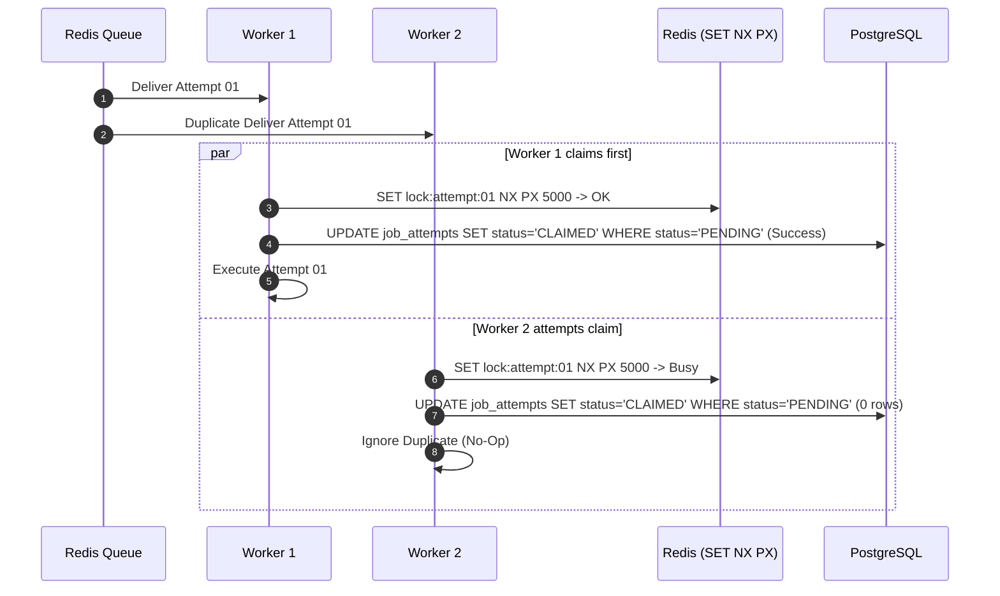
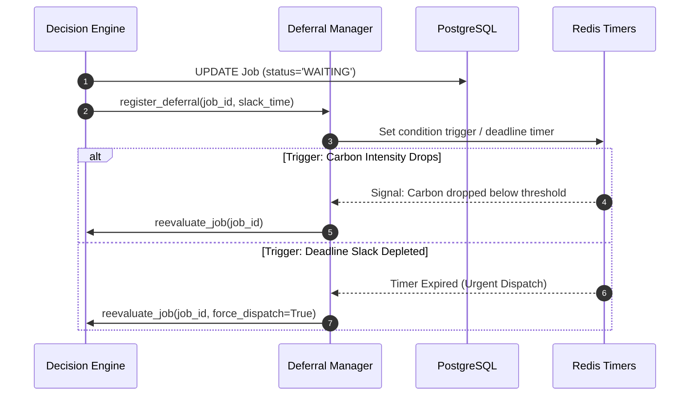

# Reliability, Retries & Data Flow Architecture

This document defines the reliability model, retry mechanics, idempotency controls, and data flows for EcoRoute.

---

## 1. Reliability & Attempt Isolation Model

```text
Job ID: job-9a7f-41bc
   │
   ├── Attempt 01 (Region: us-east-1)  ──► Status: FAILED (Simulated Timeout)
   ├── Attempt 02 (Region: eu-west-1)  ──► Status: FAILED (Regional Node Degradation)
   └── Attempt 03 (Region: us-west-2)  ──► Status: RUNNING (Currently Executing)
```

* **New Attempt per Retry**: Every retry generates a new `attempt_id` and increments `attempt_number`.
* **Fresh Central Routing**: Failed attempts report back to the Decision Engine for a fresh multi-objective evaluation under current dynamic conditions.
* **Deadline & Quota Enforcement**: Retries are permitted only if remaining retry quota ($N_{\text{attempts}} \le N_{\text{max}}$) and deadline slack ($\text{slack} \ge T_r$) are satisfied.
* **Region Locking**: Active attempts are locked to their assigned region.

---

## 2. End-to-End Data Flows

### 2.1 Normal Workload Scheduling



---

### 2.2 Carbon Fallback Hierarchy

EcoRoute enforces a strict fallback hierarchy:



> [!IMPORTANT]
> **No Carbon Fabrication**: Missing carbon data triggers graceful fallback to cache or conventional operational scheduling. Carbon values are never fabricated.

---

### 2.3 Failure Recovery & Re-routing



---

### 2.4 Duplicate Delivery Prevention (Atomic Claims)



---

### 2.5 Condition-Based Deferral & Wakeup


