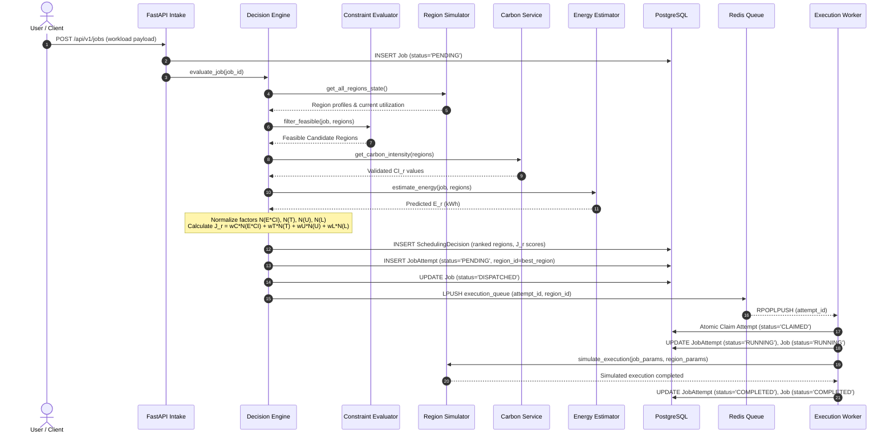
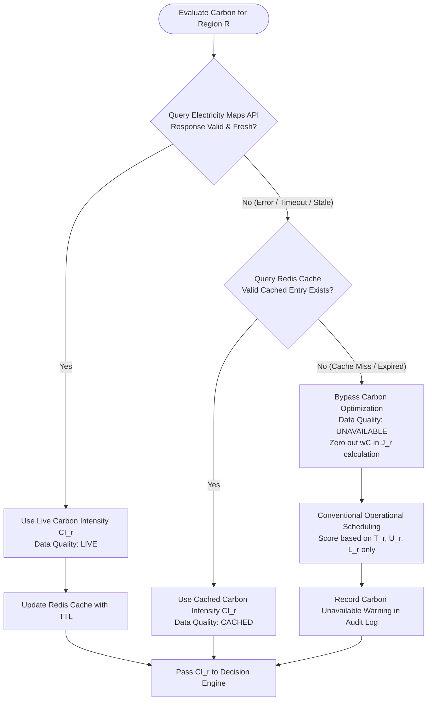
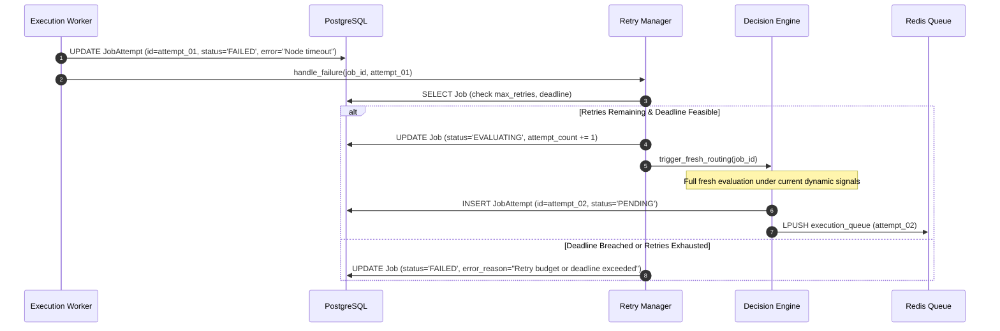
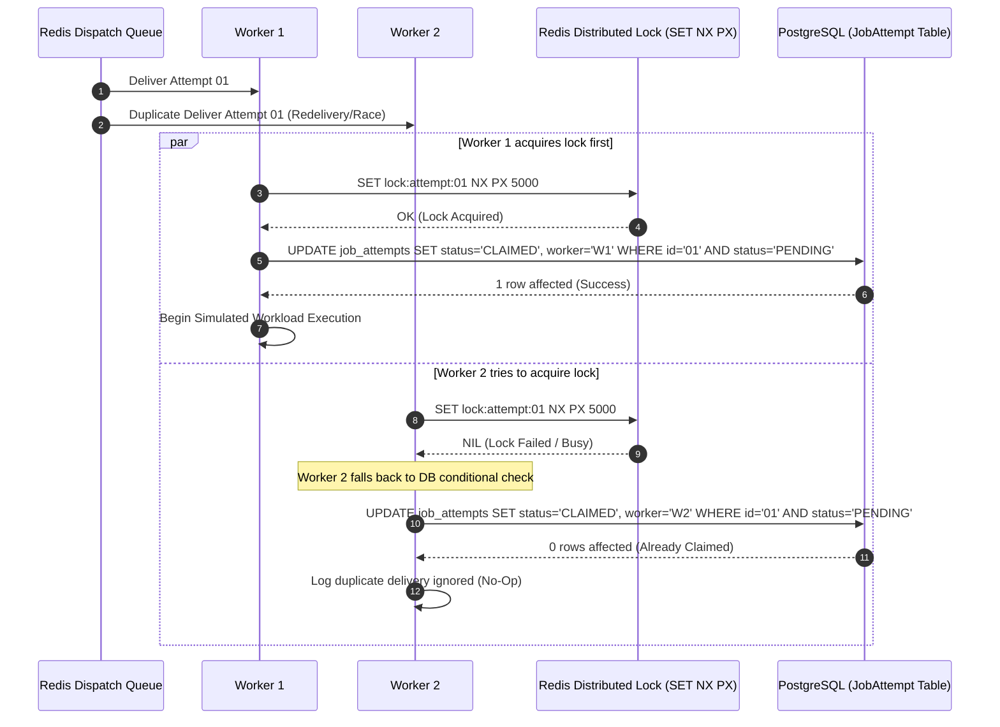
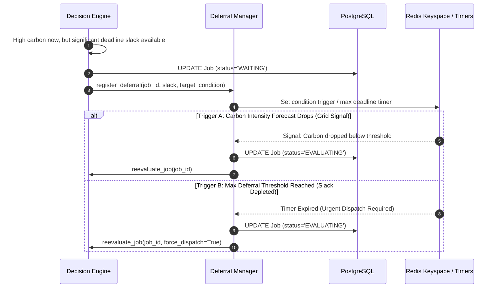

# Reliability, Retries & Data Flow Architecture

This document specifies the reliability model, retry mechanics, idempotency controls, and end-to-end data flows within EcoRoute.

---

## 1. Reliability & Attempt Isolation Model

In EcoRoute, a logical workload is decoupled from its individual execution runs.

```text
Job ID: job-9a7f-41bc
   │
   ├── Attempt 01 (Region: us-east-1)  ──► Status: FAILED (Simulated Timeout)
   ├── Attempt 02 (Region: eu-west-1)  ──► Status: FAILED (Regional Node Degradation)
   └── Attempt 03 (Region: us-west-2)  ──► Status: RUNNING (Currently Executing)
```

### Key Reliability Rules:

1. **New Attempt per Retry**: Every retry generates a new, unique `attempt_id` and increments `attempt_number`.
2. **Fresh Routing on Failure**: When an attempt fails, the worker does **not** pick the next region. The failed attempt emits a failure signal back to the Decision Engine, which conducts a fresh multi-objective evaluation across current real-time environmental conditions.
3. **Deadline & Policy Verification**: Before initiating a retry, the Retry Manager checks both the remaining retry quota ($N_{\text{attempts}} \le N_{\text{max}}$) and remaining deadline slack ($\text{slack} \ge T_r$). If exceeded, the Job transitions to `FAILED`.
4. **Region Locking**: Once an attempt transitions to `CLAIMED` / `RUNNING`, the region assignment is immutable for that attempt.

---

## 2. End-to-End Data Flows

### 2.1 Normal Workload Scheduling Flow



---

### 2.2 Carbon Data Hierarchy & Fallback Flow

EcoRoute enforces a strict fallback hierarchy for carbon intensity:



> [!IMPORTANT]
> **No Carbon Value Fabrication**: EcoRoute must never invent or interpolate missing carbon values. If live and valid cache data are unavailable, carbon optimization is explicitly bypassed, falling back to conventional operational scheduling.

---

### 2.3 Execution Failure & Re-routing Flow



---

### 2.4 Duplicate Delivery & Atomic Claim Prevention Flow

When multiple workers receive the same Attempt ID (e.g., due to redelivery, network blip, or parallel workers), atomic claim controls ensure exactly-once execution.



---

### 2.5 Condition-Based Deferral & Wakeup Flow

EcoRoute avoids arbitrary, fixed-interval polling loops. Workload deferral is condition-aware and deadline-bounded.


