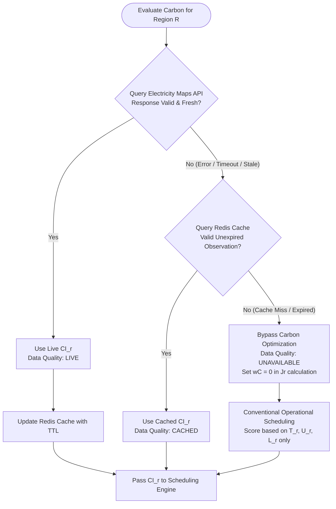

# Reliability & Failure Handling Design

This document specifies the fault tolerance models, graceful degradation strategies, and failure-handling mechanisms for EcoRoute.

---

## 1. Carbon Integration Failures

EcoRoute enforces a deterministic, zero-fabrication fallback hierarchy:



### Invariants:
1. **Zero Fabrication**: Carbon values are never synthesized, interpolated, or averaged. Missing carbon data is recorded as `NULL` with `data_quality = 'UNAVAILABLE'`.
2. **No False Carbon Claims**: The scheduler explicitly records when conventional fallback is used; it never represents missing carbon as zero emissions.

---

## 2. Worker & Attempt Failures

```text
Worker Execution Loop
         │
    Simulated Node Timeout / Error
         │
         ▼
Attempt Marked FAILED (Error Logged)
         │
         ▼
Retry Manager Verification
    ├── Check: attempt_count < max_retries
    └── Check: current_time + T_base <= deadline
         │
         ├─ Eligible ──► Decision Engine (Fresh Re-routing) ──► New Attempt ID
         │
         └─ Ineligible ──► Job Marked FAILED
```

### Key Rules:
* **Attempt Isolation**: Every retry generates a new `Attempt ID` and incremented sequence number.
* **Fresh Routing**: The scheduler re-evaluates all active regions under current real-time environmental conditions; failed attempts never blindly reuse the previous region.

---

## 3. Duplicate Delivery & Idempotency Failures

When network delays or worker queue redeliveries deliver an identical `attempt_id` to multiple workers:
* **Authoritative Protection**: PostgreSQL Compare-And-Swap (CAS) update:
  ```sql
  UPDATE job_attempts 
  SET status = 'CLAIMED', claimed_by_worker = :worker_id, claimed_at = CURRENT_TIMESTAMP 
  WHERE id = :attempt_id AND status = 'PENDING';
  ```
* **Outcome**: Exactly one worker receives `rows_affected = 1` and proceeds. All redundant workers receive `rows_affected = 0` and safely discard the duplicate message as a no-op.
* **Redis Coordination Role**: Redis mutex locks (`SET lock:attempt:<id> <worker_id> NX PX 5000`) assist with latency reduction under high concurrency, but PostgreSQL remains the sole correctness authority.

---

## 4. Infrastructure Failures

### 4.1 Redis Outage
* **Impact**: In-memory carbon cache, dispatch queue, and speed locks become temporarily unavailable.
* **Fail-Safe Behavior**:
  1. PostgreSQL remains intact as the authoritative source of truth.
  2. The Carbon Service treats cache misses as carbon `UNAVAILABLE` and falls back gracefully to conventional operational scheduling.
  3. Workers fall back directly to PostgreSQL polling for claimable attempts.
  4. Authoritative system state is never lost.

### 4.2 PostgreSQL Outage
* **Impact**: Database mutations and persistent reads fail.
* **Fail-Safe Behavior**:
  1. FastAPI returns HTTP `503 Service Unavailable` with standardized RFC 7807 problem details.
  2. The system fails safely: no attempt is reported as dispatched or completed if its state transition cannot be durably written to PostgreSQL.
  3. Stale in-memory execution without durable persistence is explicitly prohibited.
