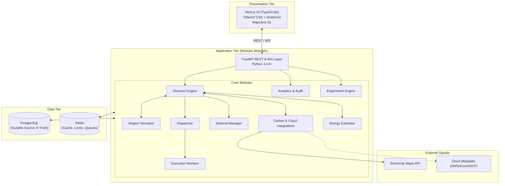

# System Architecture

## 1. Overview

EcoRoute is a two-tier system consisting of a Next.js frontend and a FastAPI modular monolith backend backed by PostgreSQL and Redis.



---

## 2. Technology Stack & Boundaries

| Component | Technology | Responsibilities | Boundary Constraints |
| :--- | :--- | :--- | :--- |
| **Frontend** | Next.js 16, TypeScript, Tailwind CSS, shadcn/ui, MapLibre GL | Workload submission UI, geographic carbon/region mapping, decision explanations, telemetry dashboards. | Presentation only; no direct access to PostgreSQL/Redis or core scheduling logic. |
| **Backend** | FastAPI (Python 3.13+), Pydantic v2, SQLAlchemy 2.0 (AsyncIO) | Workload intake, multi-objective scoring ($J_r$), regional simulation, energy estimation, retry routing, experiment execution. | Single backend process owning all state transitions, scheduling intelligence, and audit logging. |
| **Database** | PostgreSQL | Persistent store for `jobs`, `job_attempts`, `regions`, `carbon_observations`, `scheduling_decisions`, `experiments`, `audits`. | Durable ACID source of truth. |
| **Cache & Locks** | Redis | Carbon observation TTL cache, distributed locks for atomic attempt claims (`SET NX PX`), task dispatch queues. | Transient operational support only; never replaces PostgreSQL. |
| **External APIs** | Electricity Maps, AWS/Azure/GCP Metadata | Real grid carbon intensity ($g\text{CO}_2\text{eq}/\text{kWh}$); regional reference metadata. | Execution regions are logical/simulated; no real multi-cloud container/VM provisioning. |

---

## 3. Modular Monolith Architecture

EcoRoute is structured as a modular monolith to avoid distributed systems overhead while enforcing strict domain boundaries:

```text
backend/app/
├── api/                 # REST endpoints & request/response schemas
├── scheduling/          # Decision Engine, Constraint Evaluator, Scoring
├── simulation/          # Region Simulator, Workload Model
├── carbon/              # Electricity Maps client, Cache manager, Fallback
├── energy/              # Energy estimation models (idle + dynamic power)
├── execution/           # Dispatcher, Workers, Idempotency, Retry Manager
├── deferral/            # Deferral Manager, Re-evaluation triggers
├── analytics/           # Audit logging, Metrics aggregation
├── experiments/         # Scenario runner, Benchmark baselines
├── persistence/         # SQLAlchemy models, repositories, sessions
└── infrastructure/      # Redis client, distributed locks, config
```

### Rationale

1. **Simplicity & Velocity**: Eliminates inter-service network serialization, API gateway latency, and distributed transactions.
2. **Deterministic Experiments**: Shared clock and fixed random seed management are reliable in a single runtime.
3. **Clean Domain Boundaries**: Python module interfaces prevent coupling and allow future service extraction if needed.
