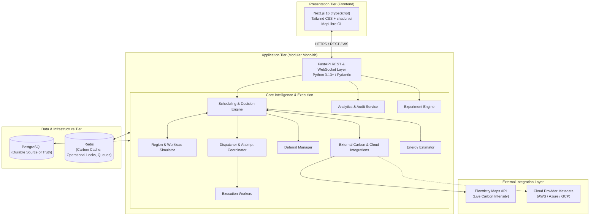

# System Architecture

## 1. High-Level Architectural Overview

EcoRoute is structured as a two-tier system consisting of a modern, responsive web application frontend and a high-performance modular monolith backend backed by relational storage and in-memory operational coordination.



---

## 2. Technology Stack & Boundaries

### 2.1 Frontend

* **Framework**: Next.js 16 (React, TypeScript)
* **Styling & UI**: Tailwind CSS, shadcn/ui components
* **Mapping/Geo**: MapLibre GL for carbon and regional geographic visualization
* **Responsibilities**:
  * Job submission and interactive parameter entry
  * Real-time monitoring of job statuses and attempt tracking
  * Interactive geographic map displaying region capacity, carbon intensity, and workload allocations
  * Visual scheduling explanations and decision factor breakdowns (carbon vs. latency vs. cost vs. deadline)
  * System analytics, carbon reduction KPIs, and benchmark experiment execution dashboards
* **Boundary Rules**:
  * The frontend is strictly a presentation and interaction layer.
  * It must **NOT** contain core scheduling or constraint evaluation logic.
  * It must **NOT** directly connect to PostgreSQL or Redis; all data flows via authenticated backend REST endpoints.

### 2.2 Backend

* **Framework**: FastAPI (Python 3.13+)
* **Validation & Types**: Pydantic v2
* **ORM & Database Abstraction**: SQLAlchemy 2.0 (AsyncIO)
* **Responsibilities**:
  * Workload intake validation, normalization, and lifecycle management
  * Scheduling intelligence, hard constraint pruning, and multi-objective scoring ($J_r$)
  * Workload and regional resource simulation
  * Live carbon data integration with validation, fallback, and caching
  * Energy and emission estimation ($E_r$, $\text{CO}_2\text{eq}$)
  * Condition- and deadline-aware deferral management
  * Atomic attempt claims, worker execution dispatch, and reliability/retries
  * Experiment orchestrations and audit trail logging

### 2.3 Data & Caching Tier

* **PostgreSQL (Durable Store of Truth)**:
  * Persistent storage for all entities: `jobs`, `job_attempts`, `regions`, `carbon_observations`, `scheduling_decisions`, `experiments`, `experiment_results`, and `audit_records`.
  * Guarantees ACID transactional integrity and historical auditability.
* **Redis (In-Memory Support Infrastructure)**:
  * High-speed caching for validated carbon intensity time-series.
  * Distributed locking mechanisms (`SET NX PX`) for atomic attempt claims and concurrent decision locks.
  * Lightweight operational queues and pub/sub for worker notifications and deferral wakeups.
  * *Constraint*: Redis is transient operational infrastructure and must never replace PostgreSQL as the durable system of record.

### 2.4 External Integrations

* **Electricity Maps**: Primary external provider for live and forecasted carbon intensity ($g\text{CO}_2\text{eq}/\text{kWh}$).
* **Cloud Provider Profiles (AWS, Azure, GCP)**: Region definitions, coordinate locations, baseline power draw specs, and latency reference matrices.
* *Constraint*: External cloud adapters are metadata sources and simulation baselines only; EcoRoute does not execute real multi-cloud container or VM provisioning.

---

## 3. Modular Monolith Architectural Style

EcoRoute is explicitly architected as a **modular monolith** rather than a distributed microservices network.

```text
backend/
├── app/
│   ├── api/                 # REST endpoints & request/response schemas
│   ├── scheduling/          # Decision Engine, Constraint Evaluator, Scoring
│   ├── simulation/          # Region Simulator, Workload Model, Degradation
│   ├── carbon/              # Electricity Maps client, Cache manager, Fallback
│   ├── energy/              # Energy estimation models (idle + dynamic power)
│   ├── execution/           # Dispatcher, Workers, Idempotency, Retry Manager
│   ├── deferral/            # Deferral Manager, Re-evaluation triggers
│   ├── analytics/           # Audit logging, Metrics aggregation, Reporting
│   ├── experiments/         # Controlled scenario runner, Benchmark baselines
│   ├── persistence/         # SQLAlchemy models, repositories, session management
│   └── infrastructure/      # Redis client, distributed locks, config/settings
```

### Rationale for Modular Monolith Architecture

1. **Simplicity and Developer Velocity**: Eliminates operational overhead (service meshes, inter-service gRPC serialization, complex distributed transactions, API gateway latency).
2. **Deterministic Simulation & Single Clock**: Scheduling experiments and reproducible simulations require tight coordination and shared seed management, which is significantly easier and more deterministic within a single runtime.
3. **Strict Boundary Isolation**: Module boundaries are enforced via clean Python interfaces and domain abstractions, preventing spaghetti dependencies while preserving single-deployment simplicity.
4. **Future Evolutionary Path**: If specific components (such as dedicated execution worker pools or ingestion pipelines) require independent horizontal scaling in future production deployments, the clean module boundaries allow seamless extraction into microservices without rewriting core logic.
